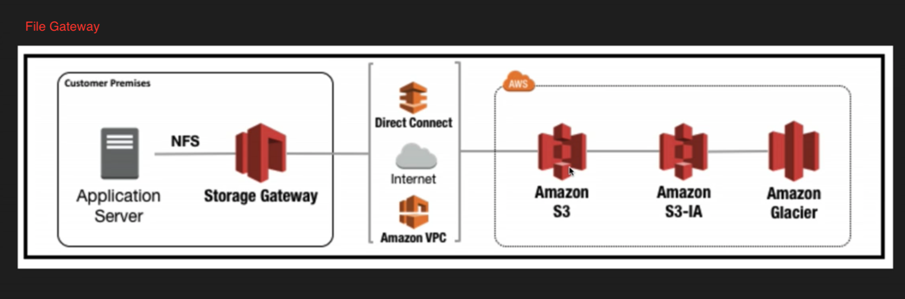
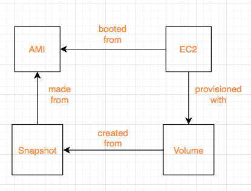

# AWS Solution Architect Associate Exam tips and notes

### Services Overview
  * An `AZ` is simply a data center - designed as redundancies to protect data center from natural disasters for example.
  * `Edge locations` it's the location where content will be cached.
  * `Region` is geographic locations in the world which consists of **2 or more AZs**.

  * `Glacier` for files archival
  * `RedShift` for data warehousing/business intelligence
  * Direct connect is a way of running a dedicated line from your data center or corporate head office directly into VPC.
  * `CloudTrail` - log changes to your aws environment i.e create a new EC2 instance, IAM.
  * `Trusted Advisor` - give you adivce on your security, how to save your money when using aws.
  * `Elastic Map Reduce` - big data

### IAM
  * Policies can be applied to Users, Groups and Roles.
  * IAM is universal and global. **NOT** specific to any particular region.
  * New Users have **NO** permissions when first created.
  * Always setup Multifactor Auth on your root account.
  * Power users are ones who have full access to AWS services but management of IAM users ,groups is not allowed to them

### S3/CDN/Glacier/CloudFront
  * Amazon guarantees S3 standard 99.999999999% durability, 99.99% availability for s3 information - 11 * 9s% you will not lose your files saved on s3.
  * Bucket policies act on bucket level while ACL acts on each individual file level.
  * S3 is object-based and can only store files.
  * Files can be from `0 Bytes to 5 TB` in size.
  * Unlimited storage
  * S3 is a universal namespace. That is, names must be unique gobally.
  * You can upload files to S3 much faster by enabling multipart upload.
  * Example bucket - Virtual-hosted style `https://s3-eu-west-1.amazonaws.com/acloudguru` or path style `http://BUCKET.s3-AWS-REGION.amazonaws.com`
  * Read after write consistency for `PUTS` of new objects.
  * Eventual Consistency for overwrite `PUTS and DELETES` (can take some time to propagate).
  * S3 Storage Classes/Tiers:
    * `S3` (durable, immediately available, frequently accessed, multi-azs).
    * `S3 - IA` (durable, immediately available, infrequently accessed, long-term storage cheaper than `S3`).
    * `S3 One Zone` (even cheaper than IA, but only in one az).
    * `Glacier` (Archived data, where you can wait `3 - 5 hrs` before accessing).
    * `S3 Reduced Redundancy Storage` (enables customers to store noncritical, reproducible data at lower levels of redundancy than Amazon S3’s standard storage).
  * Once file's been uploaded successfully, you will receive `200` status code.
  * Read S3 FAQs before taking the exam.
  * Encryptions
    * Client side Encryption
    * Server side Encryption
      * Server Side encryption with Amazon S3 Managed Keys - SSE-S3
      * Server Side encryption with KMS - SSE-KMS (Additional charges than SSE-S3, provides audit trail of when your key was used and by whom)
      * Server Side encryption with Customer Provided Keys - SSE-C
    * **By default, all buckets are private as well as objects inside them**
  * S3 Versioning
    * Very big and prone-to-change file is **NOT** suitable for versioning.
    * Stores all versions of an object (including all writes and even if you delete an object)
    * Great backup tool
    * Once enabled cannot be disabled can only be suspended
    * Versioning's MFA Detele Capbility - provide another layer of security
  * Cross Region Replication
    * Versions must be turned on for both `source` and `destination` buckets.
    * Regions must be unique.
    * Existing files **NOT** replicated. It only affects subsequently updated files.
    * Multiple buckets replication **NOT** allowed. i.e A replicates B replicates C.
    * Delete markers are replicated.
  * S3-IA & Glacier
    * Archival!!! Cost is lower.
    * Lifecycle management can be used in conjunction with versioning.
    * Lifecycle management can be applied to current/previous versions.
    * Actions can be done:
      * Transition to the S - IA Storage class (30 days after the creation date).
      * Archive to the Glacier Storage class (30 days after IA, if relevant).
      * Permanently Delete.
  * CloudFront
    * Origin - Origin of all files that the CDN will distribute
    * Distribution - This is the name given the CDN which consists of a collection of Edge Locations.
    * Edge locations are **NOT** just READ only. You can write to them too (S3 Transfer Acceleration).
      i.e Put an object onto them - object will be synced back to original server.
    * Objects will be cahced for the life of TTL. You can clear cached objects before TTL expires in exchange of charge.
    * Allow multiple origins in the same distribution.
    * **Can be configured to restrict viewer access to private contents via signed URLs or signed Cookies**
  * S3 - Security & Encryption
    * S3 buckets can be configured to create access logs which log all requests made to S3 bucket. This can be done to another bucket. Or even another bucket in a different account.
    * In Transit - use SSL/TLS
    * At Rest -
      * Server Side Encryption
        * S3 Managed Keys - SSE-S3
        * AWS Key Management Service, Managed Keys - SSE-KMS (audit trail)
        * Server Side Encryption with Customer Provided Keys - SSE-C
      * Client Side Encryption
        * Client encrypts data before syncing it to S3
  * Storage Gateway
    * A virtual appliance installed on your machines in data centre, which will replicate your information up to AWS S3 or Glacier
    * 4 Types:
      * File Gateway
      * Volumes Gateway - virtual hard disk, block storage, allows to store OS, servers. Data written to these volumes can be asynchronously backed up as point-in-time snapshots of your volumes and stored in the cloud as Amazon EBS snapshots.
        Snapshots are incremental backups that capture only changed blocks. All snapshots compressed.

        Two types
        * Stored Volumes
        * Cached Volumes - Most data stored in S3, frequently accessed data stored on premises
      * Tape Gateway - data archival solutions
      * 
      * 
    * Tips:
      * File Gateway: For flat files, stored directly on s3.
      * Volume Gateway:
        * Stored Volumes: Entire Dataset is stored on site and is async backed up to s3.
        * Cached Volumes: Entire Dataset is stored on s3 and the most frequently accessed data is cahced on site
      * Gateway Virtual Tape Library
        * Used for **backup** and uses popular backup applications like NetBackup, Backup Exec, Veeam etc.
  * Snowball
    * Import/Export - you send in your own disk to aws to sync data to aws via aws internal network
    * snowball - aws provide you the appliances to do the same thing as above
      * Import to/Export from S3
    * snowball edge - can run your lambda against them
  * S3 Static Webistes - serverless, very cheap, scales automatically, host **STATIC** sites **ONLY**
  * S3 Transfer Acceleration
    * Uses the cloudfront edge network to accelerate your uploads to S3. Instead of uploading directly to your s3 bucket, you can use a distinct URL to upload directly to an edge location which will then transfer that file to s3.

### EC2
  Price types:

  * `On Demand` - allows you to pay a fixed rate by the hour (or by the second) with no commitment (commitment - an amount of money that you have to pay, or the fact of promising to pay)
  * `Reserved` - provide you with a capacity reservation, and offer a significant discount on the hourly charge for an instance. 1 to 3 yr terms
    * Scheduled RIs are available to launch within the time window you reserve.
  * `Spot` - enables you to bid whatever price you want for instance capacity, providing for even greater savings if your applications have flexible start and end times.
    * Applications flexible start and end times.
    * Applications that are only feasible at very low compute prices.
    * Users with urgent need for large amounts of additional computing capacity.
    * **If a Spot instance is terminated by Amazon EC2, you will not be charged for a partial hour of usage. However, if you terminate the instance yourself, you will be charged for the complete hour in which the instance ran**
  * `Dedicated Hosts` - Physical EC2 server dedicated for your use. Dedicated Hosts can help you reduce costs by allowing you to use your existing server-bound software instances.
    * Might not support multi-tenant virtualization.
    * Can be purchased on-demand (hourly)
    * 20 instances per region by default. Contact aws if you need to run more
  ------------------------------------------
  #### EBS
   * Allows you to create storage volumes and attach them to EC2. Once attached, you can create a file system on top of these volumes, run a database, or use them in any other way you would use a block device. EBS volumes are placed in a specific AZ where they are automatically replicated to protect you from the failure of a single component.
   * Root volume - for os installations
   * types
     * General Purpose SSD (GP2) - balances both price and performance & `Can be a root volume` & **up to 10,000 IOPS**
     * Provisioned IOPS SSD (IO1) - for I/O intensive applications such as large relational or NoSQL databases. & `Can be a root volume` & **more than 10,000 IOPS**
     * Throughput Optimized HDD (ST1) - Big data, data warehouse, log processing and **CANNOT be a boot volume**
     * Cold HDD (SC1) - Lowest Cost Storage for infrequently accessed workloads, file server
     * Magnetic - previous generation. `Can be a root volume`
   ------------------------------------------
   * By default, EBS volumes will be deleted on ec2 instance termination. But can be specified to keep the volume
   * Root volume is simply where you can boot your OS from.
   * EBS Root Volume of your Default AMI **CANNOT** be encrypted. But this can be done when creating AMI's in the AWS console or using the api.
   * Additional volumes can be encrypted.
   ------------------------------------------
   * Security Group - any changes made to security group will take effect immediately.
   * Stateful, any traffic you allow in is automatically allows out.
   * Default security group allows all traffic from any ports in and out
   * **ONLY** support allowed rules not denied rules.
   * **CANNOT** block specific IP address. Use NACL to do it.
   ------------------------------------------
   EBS
   * Attached volume in use can be snapshot. But for root volume, instance needs to be stopped first
   ------------------------------------------
   #### RAID, Volumes & Snapshots
   * RAID - Redundant array of independent disks
   * Created by combining  multiple EBS volumes into one big EBS volume
   * RAID 5 **HIGHLY DISCOURAGED BY AWS**
   * Problem - Snapshot excludes data held in the cache by applications and OS. This tends not to matter on a single volume, however using multiple volumes in a RAID array, this can be a problem due to interdependencies of the array.

   Solution - take an application consistent snapshot.
     Stop the application from writing to disk.
     Flush all caches to the disk
     How can we do this?

     * Freeze the file system
     * Unmount the RAID array
     * Shutting down the associated EC2 instance

   * **ONLY** unencrypted snapshots can be shared
   ------------------------------------------
   #### AMI
   * It's region sepcific
   * Storage for the Root Device (Root Device Volume)
     * Instance Store (EPHEMERAL STORAGE)
     * EBS Backed Volume
   * For EBS Volumes: The root device for an instance launched from the AMI is an Amazon EBS volume created from an Amazon EBS snapshot.
   * For Instance Store Volumes: The root device for an instance launched from the AMI is an instance store volume created from a template sotred in Amazon S3.
   * Instance store cannot be detached from EC2 instances.
   * Instance store backed instances cannot be stopped. If the underlying host fails, you will lose your data.
   * EBS backed instances can be stopped. You will not lose the data on this instance if it is stopped.
   * You can reboot both, you will not lose your data.
   * By default, both ROOT volumes will be deleted on termination, however with EBS volumes, you can tell AWS to keep the root device volume.
   * 
   ------------------------------------------
   #### ELB
   * 3 types
    * Application Load Balancers - serve HTTP(S) traffic, operates at layer 7
    * Network Load Balancers - serve TCP traffic, operates at layer 4
    * Classic Load Balancers(ELB) - serve bothj HTTP/HTTPS and TCP
   * 504 Error means the gateway has timed out. This means that the application not responding within the idle timeout period
   * If you need the IPV4 address of your end user, look for `X-Forwarded-For` header.
   * You are **NEVER** given an IP address to ELB. You only get **DNS Name**.
   * Read ELB FAQ for Classic Load Balancers.
   * [How ELB works](https://docs.aws.amazon.com/elasticloadbalancing/latest/userguide/how-elastic-load-balancing-works.html)
   ------------------------------------------
   #### EC2 CloudWatch
   * Basic and default metrics
     * CPU related - credit balance, usage, cpu utilization
     * Network related - network in/out and network packets in/out
     * Disk related - read/write bytes, read/write ops
     * Status check - at the instance/host level
   * Standard Monitoring = every 5 mins
   * Detaild Monitoring = every 1 min
   * Events - helps you to respond to state changes in your AWS resources i.e EC2 comes on line.
   ------------------------------------------
   #### EC2 IAM roles
   * You can attach IAM roles to running EC2 instances and they will take effect immediately
   ------------------------------------------
   #### EC2 Instance Metadata
   * `curl http://169.254.169.254/latest/meta-data/`
   ------------------------------------------
   #### Auto-Scaling Group
   * 
   ------------------------------------------
   #### EC2 Placement Group
   * If you come across Placement Group without explicit name in the exam, it is `Clusted Placement Group`.
   * It's used for applications that need **low network latency** and **high network throughput**.
   * Clusted Placement Group **CANNOT** be spanned across multiple AZs. While Spread Placement Group can.
   * Placement Group name is unique within your aws account.
   * Certain types of instances can be launched in a placement Group (Compute Optimized, GPU, Memory Optimized, Storage Optimized).
   * AWS recommend homogenous instances within placement groups.
   * You cannot merge placement groups.
   * You cannot move an existing instance into a placement group. You can create an AMI from your existing instance, and then launch a new instance from the AMI into a placment group.
   ------------------------------------------
   #### EFS
   * EFS can be mounted to more than one EC2 instance
   * Only pay for the storage ou use (no pre-provisioning required)
   * Data is stored across multiple AZ's within a region
   * Block-based storage
   ------------------------------------------
   #### Lambda
   * Scales out automatically
   * functions are independent, 1 event = 1 function
   * serverless
   * serverless services include: `S3, API Gateway, Lambda, DynamoDB`

### Route53
  * No pre-defined IPv4 address on ELB. It only has a public DNS name
  * Major difference between `Alias record` and `CNAME record` is: `Alias record` can resolve individual aws server
    Another difference is `Alias record` is free while `CNAME record` costs money
    Always choose `Alias Record` over a `CNAME record`
  * Different routing policies
     * Simple
     * Weighted - A/B Testing. New site takes 20% traffic and old site takes 80% traffic
     * Latency - Server with the lowest latency will be used to serve traffic
     * Failover - DR site only comes online when health check on production site fails
     * Geolocation - fulfil traffic based on end users geolocations

### Database
  #### RDS
  * If EC2 cannot talk to RDS, chances are RDS security group does not allow inbound traffic from the security group where your EC2 instance is in.
  #### RDS Backup
  * Automated Backups
    * allow you to recover your database to any point in time within a `retention period`. The retention period can be between one and **35 days**. Automated Backups will take a full daily snapshot and will also store transaction logs throughout the day. When you do a recovery, AWS will first choose the most recent daily back up, and then apply transaction logs relevant to that day. This allows you to do a point in time recovery down to a second, within the retention period.
    * Enabled by default
    * backup data is stored in S3 and you get free storage space equal to the size of your database
    * So if you have an RDS instance of 10Gb, you will get 10Gb worth of storage.
    * Backups are taken within a defined window. During the backup window, storage I/O may be suspended while your data is being backed up and you may experience elevated latency.
    * backups gone when you delete the original RDS instance.
  * Snapshots
    * Done manually.
    * Backups stored even after you delete the original RDS instance.
  * When you restore either an Automatic Backup or a manual Snapshot, the restored version of the database will be a new RDS instance with a new DNS endpoint.
  * Currently, encrypting an existing DB Instance is not supported. To use Amazon RDS encryption for an exisitng database, you must first create a snapshot, make a copy of that snpashot and encrypt the copy.
  ------------------------------------------
  #### Multi-AZ
  * Multi-AZ allows you to have an exact copy of your production database in another AZ. AWS handles the replication for you, so when your production database is written to, this write will automatically be **SYNCED** to the stand by database.
  In the event of planned database maintenance, DB Instance failure, or an AZ failure, RDS will automatically failover to the standby so that database operations can resume quickly without administrative intervention.
  * **Multi-AZ is for Disaster Recovery only**. For performance improvement, you need `Read Replicas`.
  * 
  ------------------------------------------
  #### Read Replica
  * Read replicas allow you to have a read-only copy of your production database. This is achieved by using **ASYNC** replication from the primary RDS instance to the read replica. **You use read replicas primarily for very read-heavy database workloads**.
  * You **MUST** have automatic backups turned on in order to deploy a read replica.
  * You can have up to 5 read replica copies of any database.
  * You can have read replicas of read replicas (but watch out for latency).
  * Each read replica will have its own DNS endpoint.
  * You can have read replicas that have Multi-AZ.
  * You can create read replicas of Multi-AZ source databases.
  * Read replicas can be promoted to be their own databases. This breaks the replication.
  * You can have a read replica in a second region.
  * 
  ------------------------------------------
  #### DynamoDB
  * Use DynamoDB if:
    * Your db has massive reads and little writes
    * High scalability & performance
    * No SQL joins
  * Automatically redundant across multiple availability zones.
  * Manual Backup - On-demand backups and Point-in-Time recovery
  * Allows for the storage of large text and binary objects, but there is a limit of *400kb*.
  * DynamoDB scaling vs RDS scaling.
  * DynamoDB has `push button` scaling which you can scale the db instance up/down by changing capacities and press `save` button,
    There is no down time. While in terms of RDS scaling, you will inevitably have down time making it a bit hard to scale.
  ------------------------------------------
  #### RedShift
  * Data warehouse service in the cloud.
  * Really really fast and cheap.
  * Columer storage.
  ------------------------------------------
  #### Elasticache
  * Typically a particular database which is under a lot of stress/load, Elasticache is a good choice if your database is particularly read heavy and not prone to frequent changing.
  * Redshift is a good answer if the reason your database is feeling stress is because management keep running OLAP transactions on it etc.
  ------------------------------------------
  #### Aurora
  * It provides up to five times better performance than MySQL at a price point one tenth of a commercial database while delivering similar performance and availability.
  * Read Aurora FAQs
  ------------------------------------------
  #### Summary
  * RDS - OLTP(online transaction processing)
  * RedShift - OLAP(Online Analytical processing)


### VPC
  * 1 subnet = 1 az. Subnet cannot span across multiple azs. But one az can have multiple subnets.
  * By default, you can have *5* VPCs per region in your account.
  * All available AZs will be pre-defined for a particular region. VPC that resides in that region will span over all those AZs and you can later on create a subnet and specify which AZ it sits inside.
  

  * Each VPC can only allow one `Internet Gateway`
  * Default VPC has one default route table, internet gateway. Each EC2 instance has both a public and private ip address
  * The *first four* ip addresses and the *last* ip address in each subnet CIDR block are not available for you to use
  * No Transitive peering
    In this diagram, `A` can peer into `B` and `C`. But `B` cannot peer into `C`. For them to peer each other, peering needs to be established between `B` and `C`
    ```
              VPC C
               |
      VPC B - VPC A - VPC E
               |
              VPC D

    ```

    #### Security Group & Access Control Lists
      * Security Groups are stateful - outbound port automatically turned on when inbound port has been specified
        Access Control Lists are stateless - need to turn ports on for both inbound and outbound
      * Security Group does not span across multiple vpcs. You must specify the VPC the security group is created in

    #### NAT instance
      * You **MUST** disable source/destination checks on the `NAT instance`
      * Use `NAT instance` as a bastion server
      * NAT instances **must be** in a public subnet
      * There **must be** a route out of the private subnet to the `NAT instance` in order for this to work
      * The amount of traffic that `NAT instances` can support depends on the instance size. If you are bottlenecking, increate the instance size
      * `NAT instances` are behind a security group

    #### NAT gateway key points
       * Not associated with security groups
       * Scale up to `10Gbps` automatically
       * Automatically assigned a public ip address
       * No need to disable Source/Destination Checks
       * No need to patch - aws manages it for us
       * NAT gateway **MUST** in a public subnet with a route table that routes internet traffic to an internet gateway
       * In your route table, add `0.0.0.0/0` as destination and `NAT Gateway ID` as target
       * Instances that need internet access **MUST** be in a private subnet with a route table that routes internet traffic
          to the NAT gateway
       * In summary, two key points - `NAT Gateway` needs to be in public subnet **AND** it needs to be added to the main route table
       * Internet traffic flow:
       ```
        Private instances ---> NAT Gateway(in public subnet) ---> Internet Gateway
       ```
       * 

    #### Network Access Control Lists
       * Each subnet **MUST BE** associated with a NACL. If not explicitly done, default NACL will be associated with your subnet
       * One NACL can be associated with multiple subnets. But one subnet can be associated with only one NACL at a time. When you associate a network ACL with a subnet, the previous association is removed
       * NACL can span across multiple AZs
       * NACL contain a numbered list of rules that is evaluated in order, starting with lowest numbered rule
       * Block IP addresses using NACL not security groups

       |  | Default NACL | Nondefault NACL |
       | --- | --- | --- |
       | traffic  | Allow all inbound and outbound traffic | Denies all inbound and outbound traffic until you add rules |

    #### Security Groups
       * Act as a firewall for associated EC2 instances, controlling both inbound and outbound traffic at the instance level

    #### Security Groups vs Network ACL

       | Security Group | Network ACL |
       | --- | --- |
       | Operates at the instance level | Operates at the subnet level |
       | Supports allow rules only | Supports allow rules and deny rules |
       | stateful | stateless |
       | We evaluate all rules before deciding whether to allow traffic | We process rules in numbered order when deciding whether to allow traffic |
       | Applies to an instance only if someone specifies the security group when launching the instance, or associates the security group with instance later on | Automatically applies to all instances in the subnets it's associated with (therefore, you don't have to rely on users to specify the security group) |
       | By default, no inbound traffic is allowed and all outbound traffic is allowed | By default, all inbound/outbound traffic is allowed |

       * 

    #### ELB
       * When creating a VPC, you need your application load balancers to always be in at least two AZs and they **must be** public.
       * You need at least 2 public subnets in order to deploy an application load balancer.

    #### Custom VPC's and ELBs
       * You always need to put your ELB in **2** AZs and they must be public meaning there must be an Internet Gateway attached to these subnets in VPC
    #### VPC Flow Logs
       * Captures IP traffic inside your VPC, subnet and stored captured data in cloudwatch
       * You cannot enable flow logs for VPCs that are peered with your VPC unless the peer VPC is in your account.
       * You cannot tag a flow log
       * After you've created a flow log, you cannot change its configuration; for example, you cannot associate a differernt IAM role with flow log
       IP Traffic below not monitored
        * Traffic generated by instances when they contact the Amazon DNS server. If you use your own DNS server, then all traffic to that DNS server is logged
        * Traffic generated by a Windows instance for Amazon Windows license activation.
        * Traffic to and from `169.254.169.254` for instance metadata
        * DHCP traffic
        * Traffic to the reserved IP address for the default VPC router
    #### Bastion VS NAT
       * Bastion Host (Jump Boxes) allows users outside VPC with internet to *SSH or RDP* into your bastion and initiates a private connection over a private network to private instances using *SSH or RDP*
       * Best practice - Lock down `ssh` port and your specific `ip` so only you can ssh into bastion host & deploy bastion hosts into each public subnet in your VPC


### Application Services
  #### SQS
  * It is a pull-based and distributed message queueing system.
  * Decouple the components of an application.
  * Messages can contain up to *256KB* of text in any format.
  * Two types - standard vs FIFO (First-In-First-Out)
  * Messages can be kept in the queue from *1 minute to 14 days*.
  * Default retention period is *4 days*.
  * Guarantees that your message will be processed at least once.
  * Understand `visibility timeout`.
  * Default visibility timeout is *30 seconds*.
  * Increase it if your task takes more than 30 seconds.
  * Maximum `visibility timeout` is *12 hours*.
  * Long polling doesn't return a response until a message arrives in the message queue, or the long poll times out
  * As such, long polling can save you money.
  ------------------------------------------
  #### SWF
  * Has up to 1 year of retention period.
  * Workers are programs that interact with SWF to get tasks, process received tasks and return the results
  * Decider is a program that controls the coordination of tasks, i.e their ordering, concurrency, and scheduling according to the application logic.
  * Starters - An application that can initiate a workflow. Could be your e-commerce website when placing an order or a mobile app searching for bus times.
  * **Task is only assigned once and is never duplicated**
  * task-oriented API
  * keeps track of all the tasks and events in an application
  ------------------------------------------
  #### SNS
  * Push-based devliery (no polling)
  ------------------------------------------
  #### Elastic Transcoder
  * Media content transcoder i.e format conversion, thumbnail generation
  ------------------------------------------
  #### API Gateway
  * Low cost & efficient
  * scales automatically
  * throttle requests to prevent attacks
  * connect to `CloudWatch` to log all requests
  ------------------------------------------
  #### Kinesis
  * For streaming data *consumption*
    Purchase from online stores(think amazon.com), stock prices, game data, iOT, social network data,
    Geospatial data(uber)
  * 3 types
    * Kinesis stream - shards
    * Kinesis firehose - automated operations, No shards
    * kinesis analytics - run sql query against streaming data for analytics purpose
  
  
  ------------------------------------------
  #### Kinesis 101

### Extra Exam Tips
  Kinesis
  * Used to consume big data
  * Stream large amounts of social media, news feeds logs etc into the cloud
  Large amount of data processing
  * Reshift for business intelligence
  * Elastic Map Reduce for Big Data Processing
  OpsWorks
  * Orchestration Service that uses Chef
  * Look for the term `chef, recipes, cookbook` and think OpsWorks
  EBS Backed vs Instance Store
  * EBS Backed = Store Data Longt Term
  * Instance Store - Shouldn't be used for long-term data storage
  ------------------------------------------
  AWS Organizations
  * An account management service that enables you to consolidate multiple AWS accounts into an organisation that you create and centrally manage.
  * Save money by using consolidated billing
  * Unused reserved instances for EC2 are applied across the group
  * CloudTrail is on a per account and per region basis but can be aggregated into a single bucket in the paying account.
  ------------------------------------------
  Cross Account Access
  * Make it easier for you to work productively within a multi-account (or multi-role) AWS environment by making it easy for you to switch roles within the aws management console. You can now sign in to the console using your IAM user name then switch the console to manage another account without having to enter (or remember) another username or password.
  ------------------------------------------
  Resource Groups
  * Make it easy to group your resources using the tags that are assigned to them You can group resources that share one or more tags.
  ------------------------------------------
  VPC Peering
  * VPC peering connection connects your own VPCs, or with a VPC in another AWS account within a *single region*. Cannot do it across multi-region.
  * AWS uses the existing infrastructure of a VPC to create a VPC peering connection; It's neither a gateway nor a VPN connection, and does not rely on a separate piece of physical hardware. There is no single point of failure for commmunication or a bandwidth bottleneck.
  * You *CANNOT* create a VPC peering connection between VPCs that have matching or overlapping CIDR blocks.
  
  ------------------------------------------
  Direct Connect
  * AWS `Direct Connect` does *NOT* involve the internet; instead, it uses dedicated, private network connections between your intranet and VPC.
  * Takes `3-4` months to be setup.
  ------------------------------------------
  Security Token Service (STS)
  * Federation - *Combining or joining* a list of users in one domain (such as IAM) with a list of users in another domain (such as Active Directory, Facebook etc)
  * Identity Broker - A service that allows you to take an identity from point A and join it (federate it) to point B
  * Identity Store - Services like Active Directory, Facebook, Google etc.
  * Identities - A user of a service like Facebook etc.
  Workflow
  * LDAP - a directory storing data. Like a db but powerful for reading data not writing data
  
  1. Employee enters their username and password
  2. The application calls on Identity Broker. The broker captures the username and password
  3. The Identity Broker uses the organization's LDAP directory to validate the employee's identity
  4. The Identity Broker calls the new `GetFederationToken` function using IAM credentials. The call must include an IAM policy and a duration (1 to 36 hrs), along with a policy that specifies the permissions to be granted to the temporary security credentials.
  5. The Security Token Service confirms that the policy of the IAM user making the call to `GetFederationToken` gives permission to create new tokens and then returns four values to the application: An access key, a secret access key, a token and a duration (the token's lifetime).
  6. The Identity Broker returns the temporary security credentials to the reporting application
  7. The data storage application uses the temporary security credentials (including the token) to make requests to Amazon S3
  8. Amazon S3 uses IAM to verify that the credentials allow the requested operation on the given s3 bucket and key
  9. IAM provides s3 with the go-ahead to perform the requested operation
  ------------------------------------------
  Active Directory Integration
  * Use SAML to authenticate against AD
  * Auth against AD first and then be assigned the credentials
  ------------------------------------------
  Workspaces
  * Persistent
  * All data on the D drive is backed up every 12 hours
  * You do not need an AWS account to login to workspaces

### Key points outside acloudguru course
  * EC2-VPC: The instance retains its private IPv4 addresses and any IPv6 addresses when stop and restart.
    EC2-Classic: AWS releases the public and private IPv4 addresses for the instance when you stop the instance, and assign new ones when you restart it.
  * AWS Budgets gives you the ability to set custom budgets that alert you when your costs or usage exceed (or are forecasted to exceed) your budgeted amount.
  * If your current-generation Amazon EBS volume is attached to a current-generation EC2 instance type, you can increase its size, change its volume type, or (for an io1 volume) adjust its IOPS performance, all without detaching it from the instance. You can apply these changes to detached volumes as well.
  * Customers do not have full *admin privileges* to the underlying resources of RDS.
  * Create your own KMS Key to maximize the protection for your senstive environment vars in lambda.
  * Enable *versioning* and *MFA* for accidental deletion and accidental overwritting of s3 object.
  * Amazon DynamoDB Accelerator (DAX) is a fully managed, highly available, in-memory cache that can reduce Amazon DynamoDB response times from milliseconds to microseconds, even at millions of requests per second.
  * Transferring data from an EC2 instance to Amazon S3, Amazon Glacier, Amazon DynamoDB, Amazon SES, Amazon SQS, or Amazon SimpleDB in the same AWS Region has no cost at all. Refer to the Amazon EC2 Pricing on the link below for reference.
  * Reduced Redundancy Storage (RRS) is an Amazon S3 storage option that enables customers to store noncritical, reproducible data at lower levels of redundancy than Amazon S3’s standard storage. *99.99%* for both durability and availability.
  * The AWS Lambda resource limit for ephemeral disk capacity (/tmp space) per invocation is *512 MB*
  * In Amazon Redshift, you use *workload management* (WLM) to define the number of query queues that are available, and how queries are routed to those queues for processing. WLM is part of parameter group configuration. A cluster uses the WLM configuration that is specified in its associated parameter group.
  * If your Spot instance is terminated or stopped by Amazon EC2 *in the first instance hour, you will not be charged for that usage*. However, if you terminate the instance yourself, you will be charged to the nearest second. If the Spot instance is terminated or stopped by Amazon EC2 in any subsequent hour, you will be charged for your usage to the nearest second. If you are running on Windows and you terminate the instance yourself, you will be charged for an entire hour.
  * Snapshots occur *asynchronously* which means that the point-in-time snapshot is created immediately, but the status of the snapshot is pending until the snapshot is complete (when all of the modified blocks have been transferred to Amazon S3),
  * RDS is incorrect because the scenario requires you to have access to the underlying operating system of the database server. Remember that Amazon RDS is a managed database service, which means that Amazon is the one that manages the underlying operating system of the database instance and not you.
  * Elastic Beanstalk is a service that allows you to quickly deploy and manage your application in AWS. What it does is it automatically creates EC2 instances for your application, which you can also manage just like a regular instance
  * Although EBS encryption provides additional security for the EBS volumes, the application could not use this service to encrypt or decrypt each individual data that it writes on the disk. It is better to use KMS API instead to automatically encrypt the data before saving it to disk.
  * EBS snapshot for RAID
    1. Stop all I/O activity in the volumes
    2. Start EBS snapshot of volumes
    3. Wait for snapshots to complete
    4. Resume all I/O activity
  * CloudFront and ELB supports `Perfect Forward Secrecy`
  -------------------------------------------------------
  ## VERY IMPORTANT TO REMEMBER
  * EBS
    1. When you create an EBS volume in an Availability Zone, it is automatically replicated within that zone to prevent data loss due to failure of any single hardware component.
    2. An EBS volume can only be attached to one EC2 instance at a time.
    3. After you create a volume, you can attach it to any EC2 instance in the *SAME* Availability Zone
    4. An EBS volume is off-instance storage that can persist independently from the life of an instance.
    5. EBS volumes support live configuration changes while in production which means that you can modify the volume type, volume size, and IOPS capacity without service interruptions.
    6. EBS Volume Types
      * General Purpose (SSD) - aka GP2, small to medium sized database, dev and test env and boot volumes
      * Provisioned IOPS (SSD) - aka IO1, low-latency performance, I/O intensive apps such as large relational or NoSQL db.
      * Magnetic - lowest cost per gb of all EBS volume types, data is accessed infrequently, and apps where the *lowest storage cost* is important
    7. Provisioned IOPS max ratio is *50:1*
    8. Factor in *CPU utilization, I/O operations, and the minimum memory requirements* when choosing EC2 instance type
  * An elastic network interface (ENI) is a logical networking component in a VPC that represents a virtual network card. You can attach a network interface to an EC2 instance in the following ways:
    1. When it's running (hot attach)
    2. When it's stopped (warm attach)
    3. When the instance is being launched (cold attach).
  * In Auto Scaling, the following statements are correct regarding the cooldown period:
    1. It ensures that the Auto Scaling group does not launch or terminate additional EC2 instances before the previous scaling activity takes effect.
    2. Its default value is *300 seconds*.
    3. It is a configurable setting for your Auto Scaling group.
  * Largest object that can be uploaded in a single `PUT` *5 GB*
  * Decision task - tells the decider the state of the workflow execution
  * If the instance is stopped, AWS usually moves the instance to a new host computer
  * Amazon EC2 Spot instances are spare compute capacity in the AWS cloud available to you at steep discounts compared to On-Demand prices
  * A launch configuration is a template that an *Auto Scaling group* uses to launch EC2 instances. You specify information for the instances such as the ID of AMI, the instance type, a key pair etc. Once it's created, you cannot modify
  * AWS Trusted Advisor - Cost Optimization, Performance, Fault Tolerance, Security and Service Limits
  * Fault Tolerance - min number of instances *MUST* run at any given point
    High Availability - there are instances running across all AZs
  * Storage Gateway - Cached Volumes is designed for low-latency access to frequently accessed data.
  * AWS Web Application Firewall - aka WAF, helps protect your web apps from common web exploits attacks.
  * You can *ONLY* use ACLs to grant basic read/write permissions to AWS accounts and not for public access over the Internet.
  * When you create an encrypted EBS volume and attach it to a supported instance type, the following types of data are encrypted:
    * Data at rest inside the volume
    * All data moving between the volume and the instance
    * All snapshots created from the volume
    * All volumes created from those snapshots
  * In Amazon Kinesis, the producers continually push data to Kinesis Data Streams and the consumers process the data in real time. Consumers (such as a custom application running on Amazon EC2, or an Amazon Kinesis Data Firehose delivery stream) can store their results using an AWS service such as `Amazon DynamoDB, Amazon Redshift, or Amazon S3`.
  * Spot instance pricing model - 1 hr free of charge, afterwards charged to the nearest second. i.e if $0.04 per hour and the bie prices goes up to $0.06 in 90 mins then the total charge is `$0.04(60 mins) + $0.02(30 mins) = $0.06`
  *
  Maximum object size                          5 TB
  Maximum number of parts per upload           10,000
  Part numbers                                 1 to 10,000 (inclusive)
  Part size                                    5 MB to 5 GB, last part can be < 5 MB
  Maximum number of parts returned for a list parts request                         1000
  Maximum number of multipart uploads returned in a list multipart uploads request  1000
  * The instance that you want to attach to existing Auto Scaling Group must meet the following criteria:
    * The instance is in the running state.
    * The AMI used to launch the instance must still exist.
    * The instance is not a member of another Auto Scaling group.
    * The instance is in the same Availability Zone as the Auto Scaling group.
    * If the Auto Scaling group has an attached load balancer, the instance and the load balancer must both be in EC2-Classic or the same VPC. If the Auto Scaling group has an attached target group, the instance and the load balancer must both be in the same VPC.
  * Elastic Load Balancing provides access logs that capture detailed information about requests sent to your load balancer

