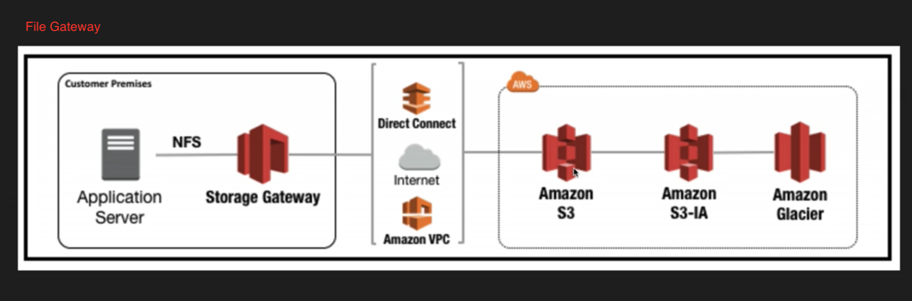
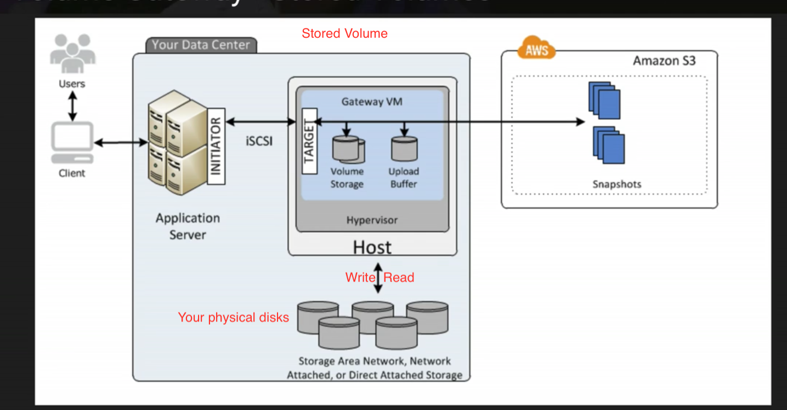
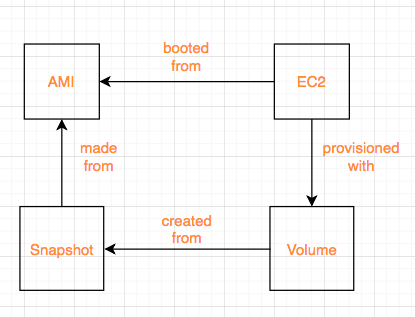
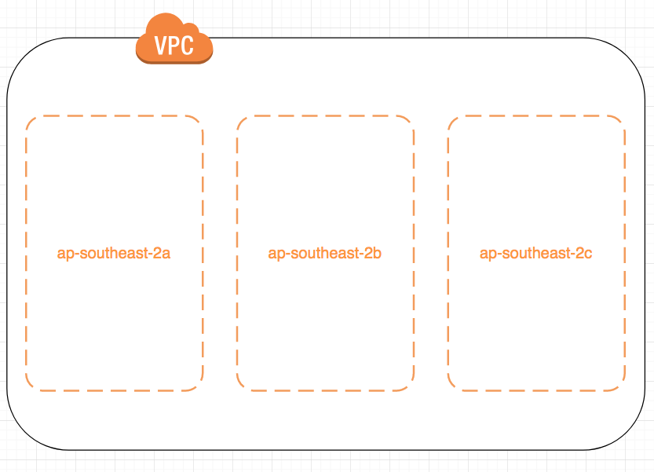

# AWS Solution Architect Associate Exam tips and notes

### Services Overview
  * An `AZ` is simply a data center - designed as redundancies to protect data center from natural disasters for example.
  * `Edge locations` it's the location where content will be cached.
  * `Region` is geographic locations in the world which consists of **2 or more AZs**.

  * `Glacier` for files archival
  * `RedShift` for data warehousing/business intelligence
  * Direct connect is a way of running a dedicated line from your data center or corporate head office directly into VPC.
  * `CloudTrail` - log changes to your aws environment i.e create a new EC2 instance, IAM.
  * `Trusted Advisor` - give you adivce on your security, how to save your money when using aws.
  * `Elastic Map Reduce` - big data

### IAM
  * Policies can be applied to Users, Groups and Roles.
  * IAM is universal and global. **NOT** specific to any particular region.
  * New Users have **NO** permissions when first created.
  * Always setup Multifactor Auth on your root account.
  * Power users are ones who have full access to AWS services but management of IAM users ,groups is not allowed to them

### S3/CDN/Glacier/CloudFront
  * Amazon guarantees S3 standard 99.999999999% durability, 99.99% availability for s3 information - 11 * 9s% you will not lose your files saved on s3.
  * Bucket policies act on bucket level while ACL acts on each individual file level.
  * S3 is object-based and can only store files.
  * Files can be from `0 Bytes to 5 TB` in size.
  * Unlimited storage
  * S3 is a universal namespace. That is, names must be unique gobally.
  * You can upload files to S3 much faster by enabling multipart upload.
  * Example bucket - `https://s3-eu-west-1.amazonaws.com/acloudguru`.
  * Read after write consistency for `PUTS` of new objects.
  * Eventual Consistency for overwrite `PUTS and DELETES` (can take some time to propagate).
  * S3 Storage Classes/Tiers:
    * `S3` (durable, immediately available, frequently accessed, multi-azs).
    * `S3 - IA` (durable, immediately available, infrequently accessed, cheaper than `S3`).
    * `S3 One Zone` (even cheaper than IA, but only in one az).
    * `Glacier` (Archived data, where you can wait `3 - 5 hrs` before accessing).
  * Once file's been uploaded successfully, you will receive `200` status code.
  * Read S3 FAQs before taking the exam.
  * Encryptions
    * Client side Encryption
    * Server side Encryption
      * Server Side encryption with Amazon S3 Managed Keys - SSE-S3
      * Server Side encryption with KMS - SSE-KMS (Additional charges than SSE-S3, provides audit trail of when your key was used and by whom)
      * Server Side encryption with Customer Provided Keys - SSE-C
    * **By default, all buckets are private as well as objects inside them**
  * S3 Versioning
    * Very big and prone-to-change file is **NOT** suitable for versioning.
    * Stores all versions of an object (including all writes and even if you delete an object)
    * Great backup tool
    * Once enabled cannot be disabled can only be suspended
    * Versioning's MFA Detele Capbility - provide another layer of security
  * Cross Region Replication
    * Versions must be turned on for both `source` and `destination` buckets.
    * Regions must be unique.
    * Existing files **NOT** replicated. It only affects subsequently updated files.
    * Multiple buckets replication **NOT** allowed. i.e A replicates B replicates C.
    * Delete markers are replicated.
  * S3-IA & Glacier
    * Archival!!! Cost is lower.
    * Lifecycle management can be used in conjunction with versioning.
    * Lifecycle management can be applied to current/previous versions.
    * Actions can be done:
      * Transition to the S - IA Storage class (30 days after the creation date).
      * Archive to the Glacier Storage class (30 days after IA, if relevant).
      * Permanently Delete.
  * CloudFront
    * Origin - Origin of all files that the CDN will distribute
    * Distribution - This is the name given the CDN which consists of a collection of Edge Locations.
    * Edge locations are **NOT** just READ only. You can write to them too (S3 Transfer Acceleration).
      i.e Put an object onto them - object will be synced back to original server.
    * Objects will be cahced for the life of TTL. You can clear cached objects before TTL expires in exchange of charge.
    * Allow multiple origins in the same distribution.
    * **Can be configured to restrict viewer access to private contents via signed URLs or signed Cookies**
  * S3 - Security & Encryption
    * S3 buckets can be configured to create access logs which log all requests made to S3 bucket. This can be done to another bucket. Or even another bucket in a different account.
    * In Transit - use SSL/TLS
    * At Rest -
      * Server Side Encryption
        * S3 Managed Keys - SSE-S3
        * AWS Key Management Service, Managed Keys - SSE-KMS (audit trail)
        * Server Side Encryption with Customer Provided Keys - SSE-C
      * Client Side Encryption
        * Client encrypts data before syncing it to S3
  * Storage Gateway
    * A virtual appliance installed on your machines in data centre, which will replicate your information up to AWS S3 or Glacier
    * 4 Types:
      * File Gateway
      * Volumes Gateway - virtual hard disk, block storage, allows to store OS, servers. Data written to these volumes can be asynchronously backed up as point-in-time snapshots of your volumes and stored in the cloud as Amazon EBS snapshots.
        Snapshots are incremental backups that capture only changed blocks. All snapshots compressed.

        Two types
        * Stored Volumes
        * Cached Volumes - Most data stored in S3, frequently accessed data stored on premises
      * Tape Gateway - data archival solutions
      * 
      * 
    * Tips:
      * File Gateway: For flat files, stored directly on s3.
      * Volume Gateway:
        * Stored Volumes: Entire Dataset is stored on site and is async backed up to s3.
        * Cached Volumes: Entire Dataset is stored on s3 and the most frequently accessed data is cahced on site
      * Gateway Virtual Tape Library
        * Used for **backup** and uses popular backup applications like NetBackup, Backup Exec, Veeam etc.
  * Snowball
    * Import/Export - you send in your own disk to aws to sync data to aws via aws internal network
    * snowball - aws provide you the appliances to do the same thing as above
      * Import to/Export from S3
    * snowball edge - can run your lambda against them
  * S3 Static Webistes - serverless, very cheap, scales automatically, host **STATIC** sites **ONLY**
  * S3 Transfer Acceleration
    * Uses the cloudfront edge network to accelerate your uploads to S3. Instead of uploading directly to your s3 bucket, you can use a distinct URL to upload directly to an edge location which will then transfer that file to s3.

### EC2
  Price types:

  * `On Demand` - allows you to pay a fixed rate by the hour (or by the second) with no commitment (commitment - an amount of money that you have to pay, or the fact of promising to pay)
  * `Reserved` - provide you with a capacity reservation, and offer a significant discount on the hourly charge for an instance. 1 to 3 yr terms
    * Scheduled RIs are available to launch within the time window you reserve.
  * `Spot` - enables you to bid whatever price you want for instance capacity, providing for even greater savings if your applications have flexible start and end times.
    * Applications flexible start and end times.
    * Applications that are only feasible at very low compute prices.
    * Users with urgent need for large amounts of additional computing capacity.
    * **If a Spot instance is terminated by Amazon EC2, you will not be charged for a partial hour of usage. However, if you terminate the instance yourself, you will be charged for the complete hour in which the instance ran**
  * `Dedicated Hosts` - Physical EC2 server dedicated for your use. Dedicated Hosts can help you reduce costs by allowing you to use your existing server-bound software instances.
    * Might not support multi-tenant virtualization.
    * Can be purchased on-demand (hourly)
  ------------------------------------------
  #### EBS
   * Allows you to create storage volumes and attach them to EC2. Once attached, you can create a file system on top of these volumes, run a database, or use them in any other way you would use a block device. EBS volumes are placed in a specific AZ where they are automatically replicated to protect you from the failure of a single component.
   * Root volume - for os installations
   * types
    * General Purpose SSD (GP2) - balances both price and performance & `Can be a root volume` & **up to 10,000 IOPS**
    * Provisioned IOPS SSD (IO1) - for I/O intensive applications such as large relational or NoSQL databases. & `Can be a root volume` & **more than 10,000 IOPS**
    * Throughput Optimized HDD (ST1) - Big data, data warehouse, log processing and **CANNOT be a boot volume**
    * Cold HDD (SC1) - Lowest Cost Storage for infrequently accessed workloads, file server
    * Magnetic - previous generation. `Can be a root volume`
   ------------------------------------------
   * By default, EBS volumes will be deleted on ec2 instance termination. But can be specified to keep the volume
   * Root volume is simply where you can boot your OS from.
   * EBS Root Volume of your Default AMI **CANNOT** be encrypted. But this can be done when creating AMI's in the AWS console or using the api.
   * Additional volumes can be encrypted.
   ------------------------------------------
   * Security Group - any changes made to security group will take effect immediately.
   * Stateful, any traffic you allow in is automatically allows out.
   * Default security group allows all traffic from any ports in and out
   * **ONLY** support allowed rules not denied rules.
   * **CANNOT** block specific IP address. Use NACL to do it.
   ------------------------------------------
   EBS
   * Attached volume in use can be snapshot. But for root volume, instance needs to be stopped first
   ------------------------------------------
   #### RAID, Volumes & Snapshots
   * RAID - Redundant array of independent disks
   * Created by combining  multiple EBS volumes into one big EBS volume
   * RAID 5 **HIGHLY DISCOURAGED BY AWS**
   * Problem - Snapshot excludes data held in the cache by applications and OS. This tends not to matter on a single volume, however using multiple volumes in a RAID array, this can be a problem due to interdependencies of the array.

   Solution - take an application consistent snapshot.
     Stop the application from writing to disk.
     Flush all caches to the disk
     How can we do this?

     * Freeze the file system
     * Unmount the RAID array
     * Shutting down the associated EC2 instance

   * **ONLY** unencrypted snapshots can be shared
   ------------------------------------------
   #### AMI
   * It's region sepcific
   * Storage for the Root Device (Root Device Volume)
    * Instance Store (EPHEMERAL STORAGE)
    * EBS Backed Volume
   * For EBS Volumes: The root device for an instance launched from the AMI is an Amazon EBS volume created from an Amazon EBS snapshot.
   * For Instance Store Volumes: The root device for an instance launched from the AMI is an instance store volume created from a template sotred in Amazon S3.
   * Instance store backed instances cannot be stopped. If the underlying host fails, you will lose your data.
   * EBS backed instances can be stopped. You will not lose the data on this instance if it is stopped.
   * You can reboot both, you will not lose your data.
   * By default, both ROOT volumes will be deleted on termination, however with EBS volumes, you can tell AWS to keep the root device volume.
   * 
   ------------------------------------------
   #### ELB
   * 3 types
    * Application Load Balancers - serve HTTP(S) traffic, operates at layer 7
    * Network Load Balancers - serve TCP traffic, operates at layer 4
    * Classic Load Balancers(ELB) - serve bothj HTTP/HTTPS and TCP
   * 504 Error means the gateway has timed out. This means that the application not responding within the idle timeout period
   * If you need the IPV4 address of your end user, look for `X-Forwarded-For` header.
   * You are **NEVER** given an IP address to ELB. You only get **DNS Name**.
   * Read ELB FAQ for Classic Load Balancers.
   * [How ELB works](https://docs.aws.amazon.com/elasticloadbalancing/latest/userguide/how-elastic-load-balancing-works.html)
   ------------------------------------------
   #### EC2 CloudWatch
   * Basic and default metrics
    * CPU related - credit balance, usage, cpu utilization
    * Network related - network in/out and network packets in/out
    * Disk related - read/write bytes, read/write ops
    * Status check - at the instance/host level
   * Standard Monitoring = every 5 mins
   * Detaild Monitoring = every 1 min
   * Events - helps you to respond to state changes in your AWS resources i.e EC2 comes on line.
   ------------------------------------------
   #### EC2 IAM roles
   * You can attach IAM roles to running EC2 instances and they will take effect immediately
   ------------------------------------------
   #### EC2 Instance Metadata
   * `curl http://169.254.169.254/latest/meta-data/`
   ------------------------------------------
   #### Auto-Scaling Group
   * 
   ------------------------------------------
   #### EC2 Placement Group
   * If you come across Placement Group without explicit name in the exam, it is `Clusted Placement Group`.
   * It's used for applications that need **low network latency** and **high network throughput**.
   * Clusted Placement Group **CANNOT** be spanned across multiple AZs. While Spread Placement Group can.
   * Placement Group name is unique within your aws account.
   * Certain types of instances can be launched in a placement Group (Compute Optimized, GPU, Memory Optimized, Storage Optimized).
   * AWS recommend homogenous instances within placement groups.
   * You cannot merge placement groups.
   * You cannot move an existing instance into a placement group. You can create an AMI from your existing instance, and then launch a new instance from the AMI into a placment group.
   ------------------------------------------
   #### EFS
   * EFS can be mounted to more than one EC2 instance
   * Only pay for the storage ou use (no pre-provisioning required)
   * Data is stored across multiple AZ's within a region
   * Block-based storage
   ------------------------------------------
   #### Lambda
   * Scales out automatically
   * functions are independent, 1 event = 1 function
   * serverless
   * serverless services include: `S3, API Gateway, Lambda, DynamoDB`

### Route53
  * No pre-defined IPv4 address on ELB. It only has a public DNS name
  * Major difference between `Alias record` and `CNAME record` is: `Alias record` can resolve individual aws server
    Another difference is `Alias record` is free while `CNAME record` costs money
    Always choose `Alias Record` over a `CNAME record`
  * Different routing policies
    * Simple
    * Weighted - A/B Testing. New site takes 20% traffic and old site takes 80% traffic
    * Latency - Server with the lowest latency will be used to serve traffic
    * Failover - DR site only comes online when health check on production site fails
    * Geolocation - fulfil traffic based on end users geolocations

### Database
### VPC
  * 1 subnet = 1 az. Subnet cannot span across multiple azs. But one az can have multiple subnets
  * All available AZs will be pre-defined for a particular region. VPC that resides in that region will span over all those AZs and you can later on create a subnet and specify which AZ it sits inside.
  

  * Each VPC can only allow one `Internet Gateway`
  * Default VPC has one default route table, internet gateway. Each EC2 instance has both a public and private ip address
  * The *first four* ip addresses and the *last* ip address in each subnet CIDR block are not available for you to use
  * No Transitive peering
    In this diagram, `A` can peer into `B` and `C`. But `B` cannot peer into `C`. For them to peer each other, peering needs to be established between `B` and `C`
    ```
              VPC C
               |
      VPC B - VPC A - VPC E
               |
              VPC D

    ```

    #### Security Group & Access Control Lists
      * Security Groups are stateful - outbound port automatically turned on when inbound port has been specified
        Access Control Lists are stateless - need to turn ports on for both inbound and outbound
      * Security Group does not span across multiple vpcs. You must specify the VPC the security group is created in

    #### NAT instance
      * You must disable source/destination checks on the `NAT instance`
      * Use `NAT instance` as a bastion server
      * NAT instances **must be** in a public subnet
      * There **must be** a route out of the private subnet to the `NAT instance` in order for this to work
      * The amount of traffic that `NAT instances` can support depends on the instance size. If you are bottlenecking, increate the instance size
      * `NAT instances` are behind a security group

    #### NAT gateway key points
       * Not associated with security groups
       * Scale up to `10Gbps` automatically
       * Automatically assigned a public ip address
       * No need to disable Source/Destination Checks
       * No need to patch - aws manages it for us
       * NAT gateway *must be* in a public subnet with a route table that routes internet traffic to an internet gateway
       * Instances that need internet access *must be* in a private subnet with a route table that routes internet traffic
          to the NAT gateway
       * In summary, two key points - `NAT Gateway` needs to be in public subnet **AND** it needs to be added to the main route table
       * Internet traffic flow:
       ```
        Private instances ---> NAT Gateway(in public subnet) ---> Internet Gateway
       ```
       * 

    #### Network Access Control Lists
       * Each subnet **MUST BE** associated with a NACL. If not explicitly done, default NACL will be associated with your subnet
       * One NACL can be associated with multiple subnets. But one subnet can be associated with only one NACL at a time. When you associate a network ACL with a subnet, the previous association is removed
       * NACL can span across multiple AZs
       * NACL contain a numbered list of rules that is evaluated in order, starting with lowest numbered rule
       * Block IP addresses using NACL not security groups

       |  | Default NACL | Nondefault NACL |
       | --- | --- | --- |
       | traffic  | Allow all inbound and outbound traffic | Denies all inbound and outbound traffic until you add rules |

    #### Security Groups
       * Act as a firewall for associated EC2 instances, controlling both inbound and outbound traffic at the instance level

    #### Security Groups vs Network ACL

       | Security Group | Network ACL |
       | --- | --- |
       | Operates at the instance level | Operates at the subnet level |
       | Supports allow rules only | Supports allow rules and deny rules |
       | stateful | stateless |
       | We evaluate all rules before deciding whether to allow traffic | We process rules in numbered order when deciding whether to allow traffic |
       | Applies to an instance only if someone specifies the security group when launching the instance, or associates the security group with instance later on | Automatically applies to all instances in the subnets it's associated with (therefore, you don't have to rely on users to specify the security group) |

       * 

    #### ELB
       * When creating a VPC, you need your application load balancers to always be in at least two AZs and they **must be** public.


### Application Services
  #### SQS
  #### SWF
  #### SNS
  #### Elastic Transcoder
  #### API Gateway
  #### Kinesis 101


### Undone sessions
  * 26
