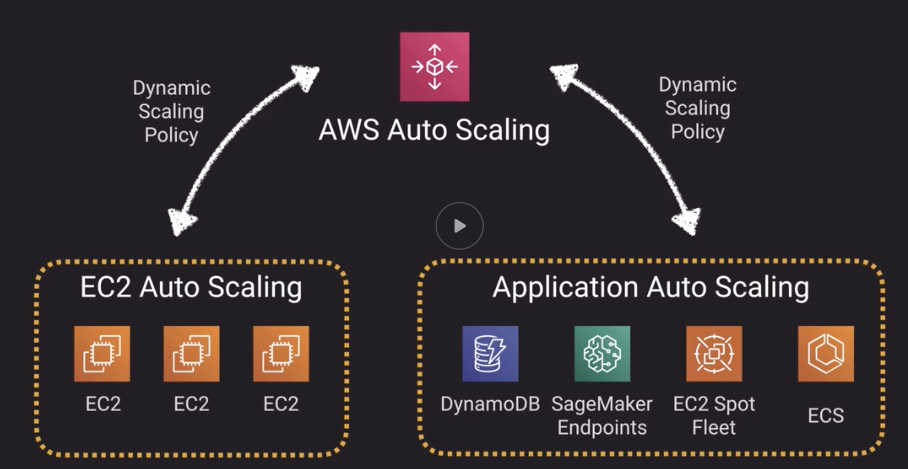
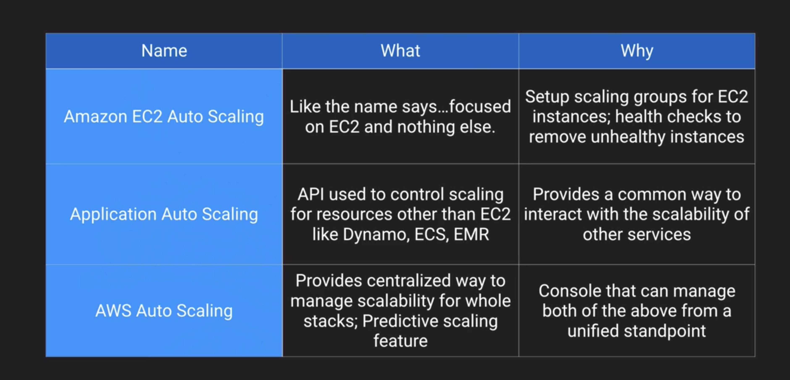
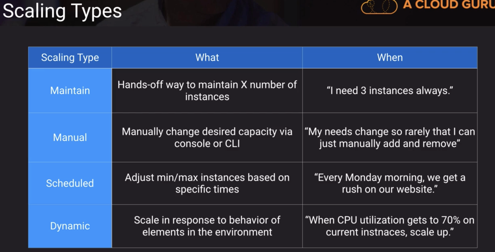
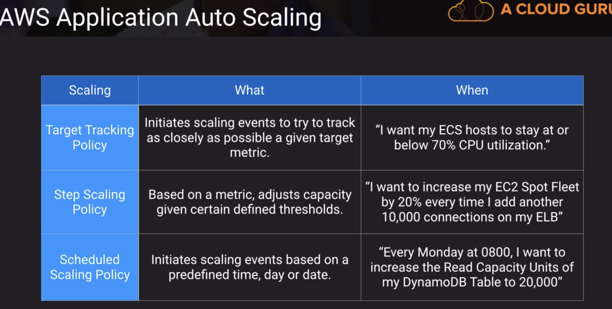
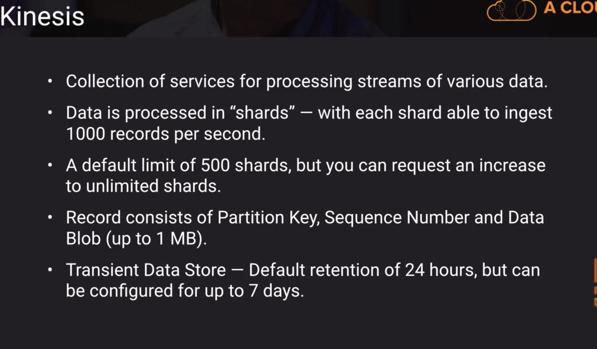
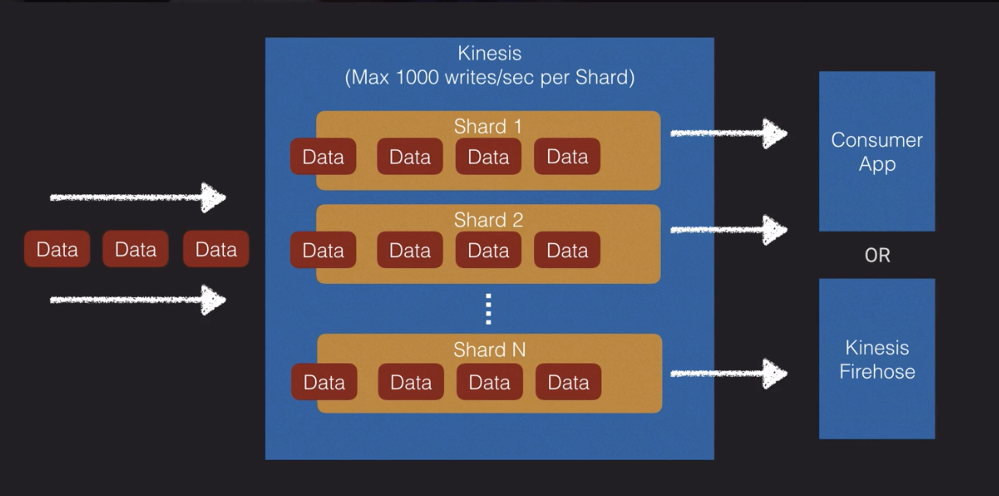

## Autoscaling

### Kinesis

Different flavours:
- Kinesis Video Streams
- Kinesis Data Streams
- Kinesis Data Firehose
- Kinesis Data Analytics

Amazon Kinesis `Data Firehose` can send data to:

- Amazon S3
- Amazon Redshift
- Amazon Elasticsearch Service
- Splunk

To do the same thing with `Amazon Kinesis Data Streams`, you would need to write an application that consumes data from the stream and then connects to the destination to store data.

So, think of Firehose as a pre-configured streaming application with a few specific options. Anything outside of those options would require you to write your own code.

### DynamoDB

#### RCU and WCU
RCU and WCU defined at table/index determines the capacity DynamoDB has to handle read and write. i.e 1 RCU allows 2 eventual consistency reads of record up to 4kb per second. That means, if you call DynamoDB read api to fetch an item sized at 8kb. you need 1 RCU. If you have more than 1 read api call within a second, then it consumes more RCU. And request might be throttled if required RCU exceeds provisioned one.