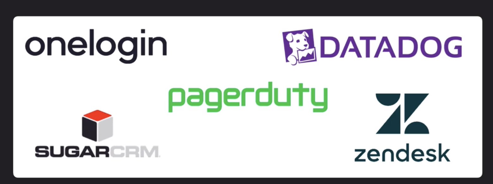

## Autoscaling


### Kinesis

Different flavours:
- Kinesis Video Streams
- Kinesis Data Streams
- Kinesis Data Firehose
- Kinesis Data Analytics

Amazon Kinesis `Data Firehose` can send data to:

- Amazon S3
- Amazon Redshift
- Amazon Elasticsearch Service
- Splunk

To do the same thing with `Amazon Kinesis Data Streams`, you would need to write an application that consumes data from the stream and then connects to the destination to store data.

So, think of Firehose as a pre-configured streaming application with a few specific options. Anything outside of those options would require you to write your own code.


#### SQS vs Kinesis

SQS - Messaging service. Message queue to store messages between distributed application components.

Kinesis - Streaming service. Handle real-time processing of big data with minimal delay.

### DynamoDB

- Max item size <= 400kb

#### Partition Calculations

```
By Capacity      - (Total RCU / 3000) + (Total WCU / 1000)
By Size          - Total Size / 10 GB (max volume for each partition)
Total Partitions - Round up for `Max(By Capacity, By Size)`
```
i.e Given 10GB table, 2000 RCU and 2000 WCU, we will have 3 partitions - `RoundUp(2.66, 1)`

#### RCU and WCU
RCU and WCU defined at table/index determines the capacity DynamoDB has to handle read and write. i.e 1 RCU allows 2 eventual consistency reads of record up to 4kb per second. That means, if you call DynamoDB read api to fetch an item sized at 8kb. you need 1 RCU. If you have more than 1 read api call within a second, then it consumes more RCU. And request might be throttled if required RCU exceeds provisioned one.

#### Hot partition

When read/write requests landed on one single partition are more than the other partitions. i.e say you have 3 partitions with 30 RCU in total. Behind the scene, total RCU will be allocated evenly across all partitions - with each one has 10 RCU. When hot partition occurs, one partition might consume all assigned RCU.

This will cause `requests being throttled`.

#### Auto Scaling

- Using `Target Tracking` method to try to stay close to target utilization. i.e when scaling out is required, Application Auto Scaling api will be triggered to add more RCU/WCU to the table/global secondary index which in turn will add more partitions - refer to partition calculations above.
- Currently does not scale down if table's consumption drops to zero
    - workaround 1: Send requests to the table until it auto scales down
    - workaround 2: Manually reduce the max capacity to be the same as minimum capacity
- Also supports Global Secondary Indexes - think of them like a copy of the table but with different sort/range keys.

#### On-Demand scaling

- Alternative to Auto-scaling
- Useful if you cannot deal with scaling lag or truly have no idea of the anticipated capacity requirements
- Instantly allocates capacity as needed with no concept of provisioned capacity
- `Cost more than traditional provisioning and auto-scaling`

#### Accelorator (DAX)

A in-memory caching service sits in front of dynamodb table

Good use cases:

- Require fastest possible reads such as live auctions or securities trading
- Read-intense scenarios where you want to offload the reads from DynamoDB
- Repeated reads against a large set of DynamoDB data

Bad use cases:

 - Write-intensive apps that don't have many reads
 - Apps where you use client caching methods

 ### CloudFront

 

 - To increase your cache hit ratio, you can configure your origin to add a `Cache-Control max-age` directive to your objects, and specify the longest practical value for `max-age`. The shorter the cache duration, the more frequently CloudFront forwards requests to your origin to determine if an object has changed and to get the latest version.

 ### SNS

- Enable a pub/sub design pattern
- Topics - A channel for publishing a notification
- Subscription - Configuring an endpoint to receive messages published on the topic


### SQS

- Available integration with KMS for encrypted messaging
- Transient storage - `default 4 days, max 14 days`
- max message size of `256kb`.
- FIFO queue downside - if a message fails or gets stuck, it will hold up all messages behind it causing latency

#### Amazon MQ

- Managed implementation of Apache ActiveMQ
- Use SQS if you creating a new app from scratch
- Use MQ if you want an easy low-hassle path to migrate from existing on-prem message brokers to AWS

### Amazon EventBridge

Designed to link variety of AWS and 3rd party apps to rules logic for launching other event-based actions



i.e for an index has been created on `zendesk`, it triggers an event in bridge and which in turn calls a lambda to do something

### Simple Workflow Service (SWF)

- workflow/order fulfillment
- **manual review steps invovled**

### Step Functions

AWS Step Functions is a fully managed service that makes it easy to coordinate the components of distributed applications and microservices using visual workflows. It includes features below:

- Managed workflow and orchestration platform
- Scalable and highly available
- Define your app as a state machine
- Create tasks, sequential/parallel steps, branching paths or timeers
- Amazon State language declarative JSON
- Apps can interact and update the stream via Step Function API
- Visual interface describes flow and realtime status
- Detailed logs of each step execution


### Comparisons


### EMR - Elastic MapReduce

- Managed Hadoop framework for processing huge amounts of data
- Also supports Apache Spark, HBase, Presto and Flink
- Most commonly used for log analysis, financial analysis or extract, translate and loading activities
