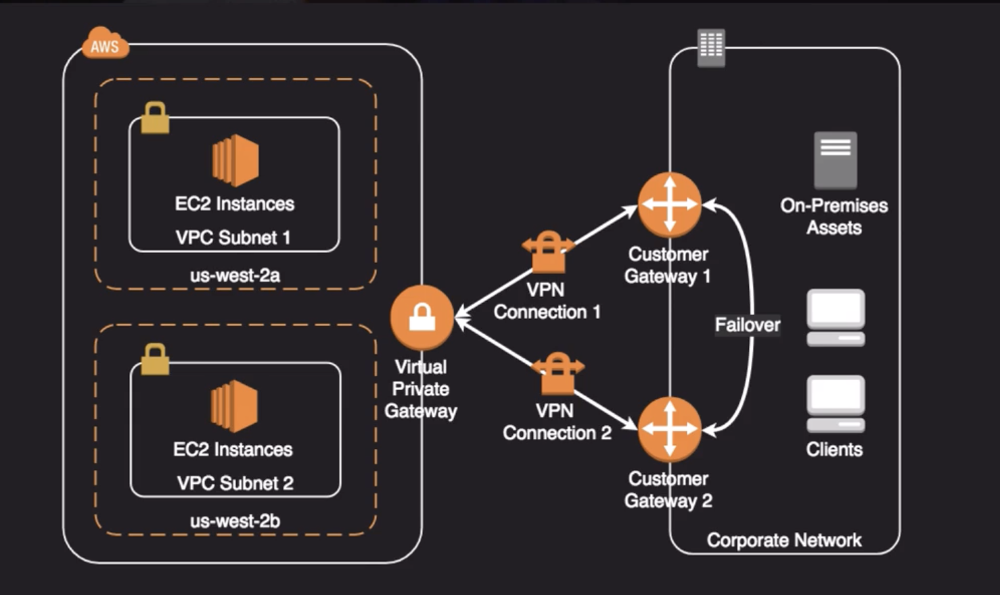

### Business Continuity

#### BC vs DR

- Business Continuity - Seesk to minimise business activity disruption when something unexpected happens
- Disaster Recovery - Act of responding to an event that threatens business continuity

#### RTO vs RPO

- Recovery Time Objective - time that it takes after a disruption to restore business processes to ther service levels
- Recovery Point Objective - Acceptable amount of data loss measured in time. Time between the good data set and disaster happens

#### AWS Continuum of HA

From least recovery time/cost to most recovery time/cost

Backup and restore

Pilot Light

Warm standby

Multi site

#### Storage HA Options

EBS Volume

- Annual Failure Rate less than 0.2% compared to commodity hard drive at 4% (Given 1000 EBS vols, expect around 2 to fail per year)
- Availability target of 99.999%
- Replicated automatically **within a single AZ**
- **Vulernable to AZ failure. plan accordingly**
- Easy to snapshot, which is stored on s3 and multi-az durable
- You can copy snapshots to other regions as well
- Supports RAID config

RAID Config

S3 Storage

- Standard & Standard-IA have multi-AZ durability; one-zone only as single AZ durability
- **Backing service for EBS snapshots and many other AWS services**

EFS

- Implementation of the NFS file system
- True file system as opposed to block storage EBS and s3
- File locking, strong consistency, concurrently accessible
- Each file object and metadata is stored across multi AZs
- can be accessed from all AZs concurrently
- Mount targets are highly available

Other options

Compute options

- Up-to-date AMIs are critical for rapid fail-over
- AMIs can be copied to other regions for safety or DR staging
- Horizontally scalable architecture are preferred because risk can be spread across multiple smaller machines versus one large machine
- Reserved instances is the **only** way to guarantee that resources will be available when needed
- Auto scaling and elastic load balancing work together to provide automated recovery by maintaining minimum instances
- Route53 health check also provide `self-healing` redirection of traffic

#### Database HA options

- If possible, choose DynamoDB over RDS because of inherent fault tolerance - has built-in redundancies and failover.
- Choose `Aurora` if relational db needs to be used
- If `Aurora` cannot be used, choose Multi-AZ RDS.
- Frequent RDS snapshots can protect against data corruption or failure and they won't impact performance of multi-az deployment
- Regional replication is also an option, but will not be strongly consistent
- If db on ec2, you will have to design HA yourself

RDS

solid line - async
dashed line - sync

Redshift

- Not support multi-az
- Best HA option is to use a multi-node cluster which support data replication and node recovery
- A single node Redshift cluster does not support data replication. and you will have to restore from a snapshot on s3 if a drive fails

ElasticCache

#### Network options

- By creating subnets in available AZs, you create multi-az presence for your VPC
- Best practice is to create at least two VPN tunnels into your Virtual Private Gateway
- Direct Connect is not HA by default, so you need to establish a secondary connection via another Direct Connect (ideally with another provider) or use a VPN
- Route 53's Health Checks provide basic level of redirecting DNS resolutions
- EIP allow you flexibility to change out backing assets without impacting name resolution
- For Multi-AZ redundancy of NAT Gateway, create gateways in each AZ with routes for private subnets to use the local Gateway

