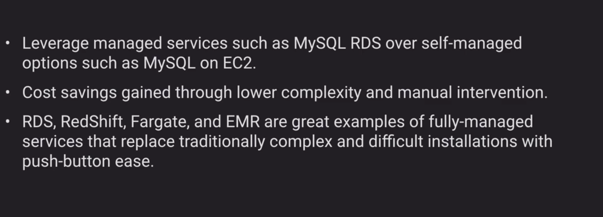
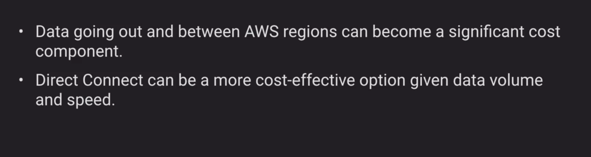
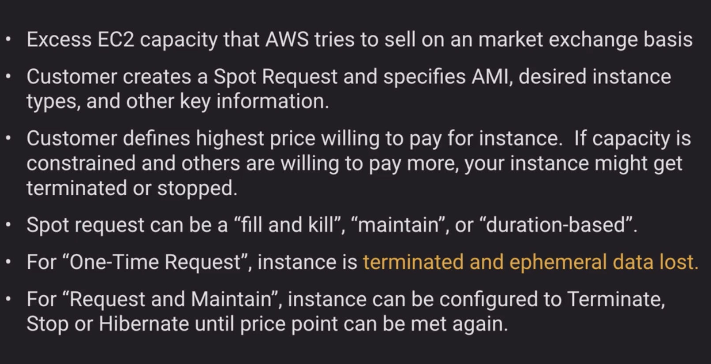

## Cost Management

Appropriate Provisioning


Right Sizing


Purchase Options


Geo Selection


Managed Services


Optimized Data Transfer



### Tagging

- Tagging strategies can be used for Cost Allocation, Security, Automation and many other uses.

For example, we can use a tag in an IAM policy to implement access controls to certain resources

```json
{
    "Version": "2012-10-17",
    "Statement": [
        {
            "Effect": "Allow",
            "Action": [
                "ec2:StartInstances",
                "ec2:StopInstances"
            ],
            "Resource": "arn:aws:ec2:*:*:instance/*",
            "Condition": {
                "StringEquals": {"ec2:ResourceTag/Owner": "${aws:username}"}
            }
        },
        {
            "Effect": "Allow",
            "Action": "ec2:DescribeInstances",
            "Resource": "*"
        }
    ]
}
```
As shown above, ec2s are restricted to be accessed by current user which is tagged as `Owner` on them.

- Enforcing standardized tagging can be done via AWS Config Rules or custom scripts.

For example, EC2 instances not propery tagged are
stopped or terminated nightly

- Most resources can have up to 50 tags.

### Resource Groups

- Resource Group are groupings of AWS assets defined by tags
- Create custom consoles to consolidate metrics, alarms and config details around given tags


### Spot/Reserved Instances

Reserved Instances


Reserved Instances Attrs


Reserved Instances


Spot Instances


### Dedicated host/instance

![dedicated-host-dedicated-instance.png]

### Cost Management Tool

Consolidated Billing


Trusted Advisory

