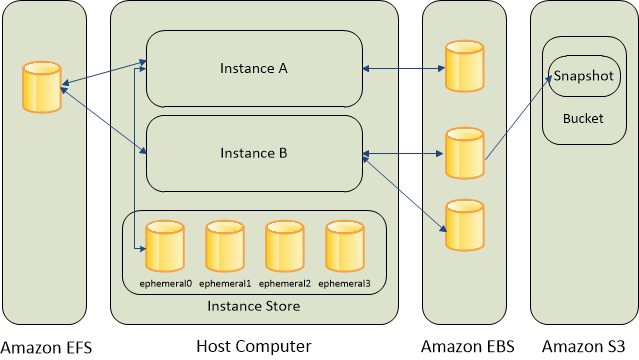
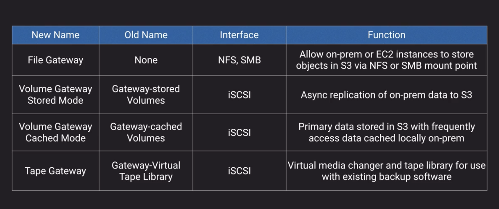
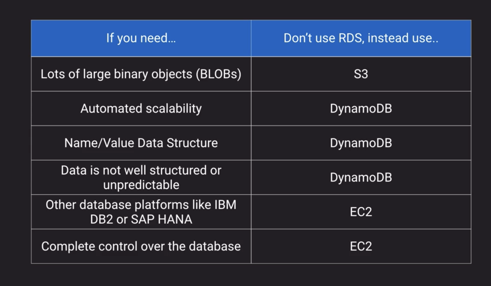
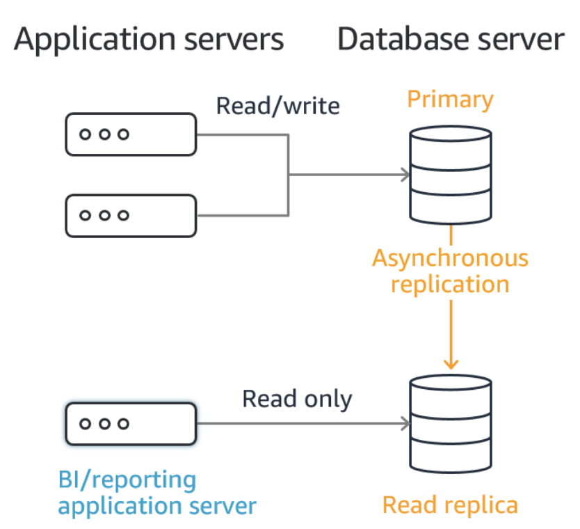
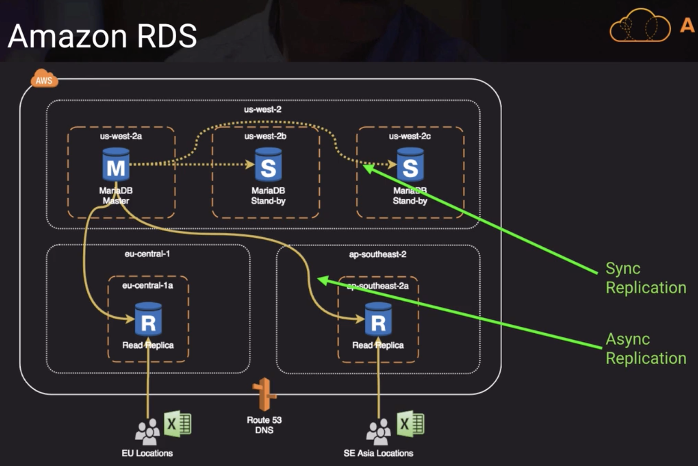
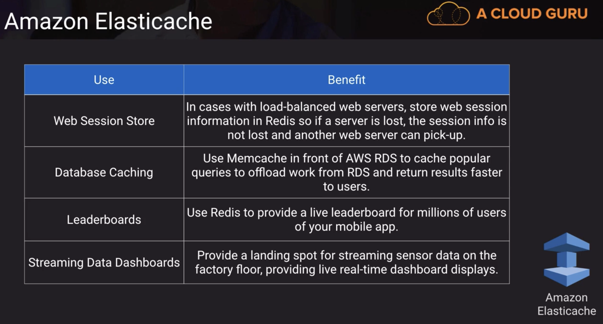
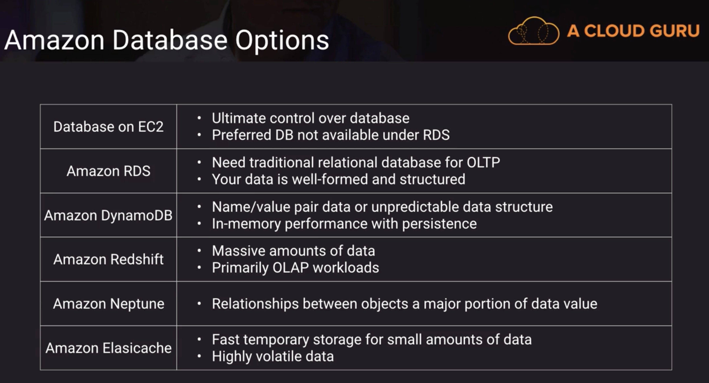

## Data store

- [S3](#s3)
  - [consistency model](#consistency-model)
  - [security](#security)
- [Glacier](#glacier)
- [EBS](#ebs)
- [EFS](#efs)
- [Storage gateway](#storage-gateway)
- [WorkDocs](#workdocs)
- [DB on ec2](#db-on-ec2)
- [RDS](#rds)
- [DynamoDB](#dynamoDB)
- [Redshift](#redshift)
- [Neptune](#neptune)
- [ElasticCache](#elasticcache)
- [DocumentDB](#documentdb)
- [DB options comparison](#db-options-comparison)

### S3

- object store
- used in other aws services - directly or behind-the-scenes
- max object size - 5TB but largest object in a single put is 5GB
- use multi-part upload if object larger than 100MB
- `s3://bucket/finance/april/16/invoice_45675.pdf` is a key NOT a file path!

#### Consistency model

- `read-after-write` consistency - object is available immediately after write
- `HEAD or GET request of a non-existent key before commiting a write will result in eventual consistency`

```
GET /key-prefix/cool-file.jpg 404
PUT /key-prefix/cool-file.jpg 200
GET /key-prefix/cool-file.jpg 404 - response for the first `GET` is returned until `PUT` propagates
```

- `eventual consistency for PUTs and DELETEs` - serve the current file until operations propagate elsewhere
- `update to a single key are atomic` - only one person can update the object at any given time. If two requests, they need to be processed in the order of their timestamps. You will see the updates as soon as I replicate elsewhere.

#### Security

Fine-grained control

Resource-based

- Bucket policy controls if an user has access to bucket
- Object ACL controls if an user has access to an object
  User-based
- IAM controls if an user has access to s3
  Optional multi-factor auth b4 delete
  If all conditions are met, you can access to that object.

---

### Glacier

- AWS archiving service
- Integrated with S3 via lifecycle management
- Faster retrieval speed options if you pay more (Remember, it's meant to be an archiving service instead of a regular data storage service⚠️⚠️⚠️ even if it could be faster)

---

### EBS

- "Virtual hard drives"
- can ONLY be used with EC2
- Tied to a single AZ
- can be detached and attached to another EC2
- able to create snapshots - hard copy of EBS state at one particular time

Benefits:

- Cost-effective and easy backup strategy i.e snapshot one contains everything. later on if you make a change and make another snapshot, the second snapshot only contains the change you've made. As a result, AWS only charge the space taken up for storing the change.
- share data sets with other users or accounts
- migrate a system to a new az or region
- convert unencrypted volume to an encrypted volume

Data lifecycle manager allows us to schedule creation/deletion of snapshots for volumes or instances every X hours. Specify retention rules to remove stale snapshots, which save us cost

#### Instance store

- temporary
- ideal for caches, buffers, work areas
- Data goes away when EC2 is stopped or terminated
- Better performance than EBS

---

### EFS

- Implementation of NFS file share
- pay for only what you use (in contrast to EBS)
- Multi-az support
- ⚠️ Cost wise, it's 3 times more expensive than EBS. 20 times more expensive than s3

#### EBS vs EFS



---

### Storage Gateway

- a virtual machine you can download
- provides local storage resources backed by AWS S3 and Glacier
- it can sync on-prem dataa back and forth to s3 and Glacier
- ⚠️ often used in disaster recovery
- Useful in cloud migration - migrate on-prem data to the cloud



---

### WorkDocs

- aws version of google drive or dropbox
- can integrate with AD for SSO

---

### DB on EC2

- Must manage everything like backups, redundancy, patching and scaling yourself
- Good option if you require a database not yet supported by RDS such as IBM DB2 or SAP HANA
- Good option if it's not feasible to migrate to AWS-managed database

---

### RDS

- Managed database option for MySQL, Maria, PostgreSQL MS-sql-server, Oracle and Aurora
- ⚠️ Best for structured, relational data store needs
- Aims to be drop-in replacement for existing on-prem instances of same databases
- Automated backups and patching in customer-defined maintenance windows
- Push-button scaling, replication and redundancy



#### Read Replication

- Easy to elastically scale out beyond the capacity constraints of a single DB instance for read-heavy database workloads
- Create one or more replicas of a given source DB Instance and serve high-volume application read traffic from multiple copies of your data, thereby increasing aggregate read throughput
- Read replicas can also be promoted when needed to become standalone DB instances
- Read replicas are **asynchronous**



#### Multi-AZ

- RDS automatically creates a primary DB instance and \*\*synchronously replicates the data to a standby instance in a different AZ
- In the event of an infrastructure failure, RDS performs an automatic failover to the standby so that you can resume database operations as soon as the failover is complete



---

### DynamoDB

- AWS managed, multi-AZ NoSQL data store with cross-region replication option
- Defaults to eventual consistency reads but can request strongly consistent read via SDK parameter
- Priced on throughput rather than compute. provisioned RCU and WCU
- On-Demand capacity for flexible capacity at a small premium cost
- Able to achieve ACID compliance with DynamoDB Transactions

---

### Redshift

- Fully managed, clustered peta-byte scale ⚠️ **data warehouse**
- Extremely cost-effective as compared to some other on-premises data warehouse platforms
- PSQL compatible with JDBC and ODBC dirvers available; compatible with most BI tools out of the box

---

### Neptune

- fully-managed graph database

---

### ElasticCache

- ⚠️ NOT a persistent data store solution



---

### DocumentDB

- AWS version of MangoDB as it's fully compatible with MongoDB

---

### DB options comparison


