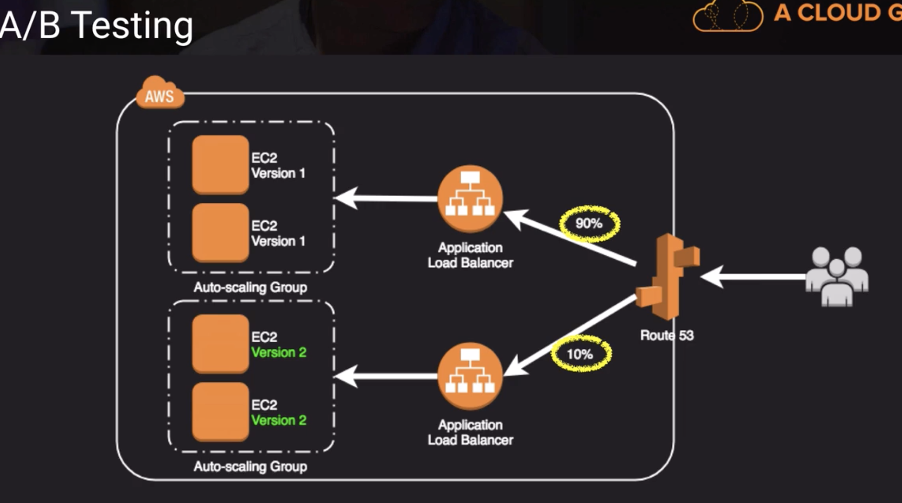
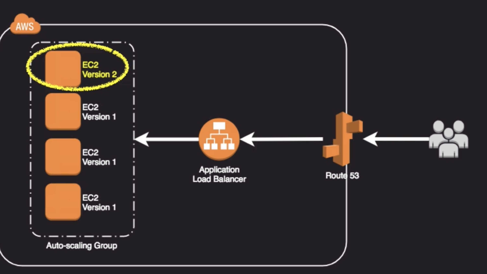
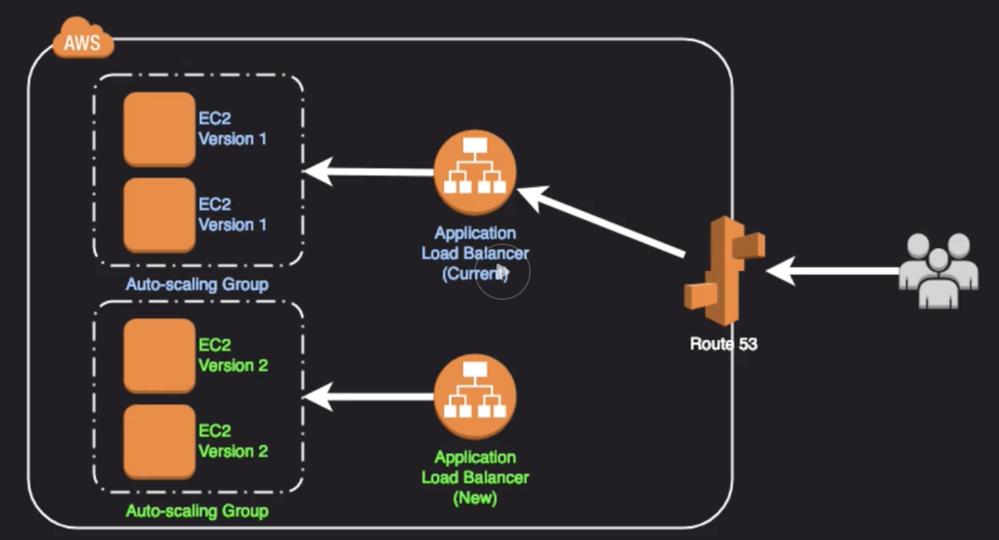
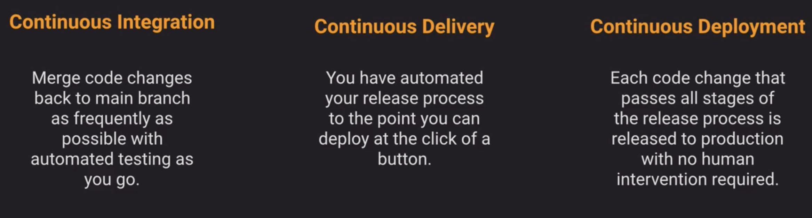
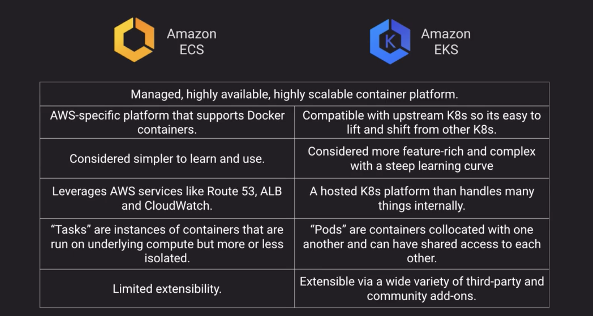
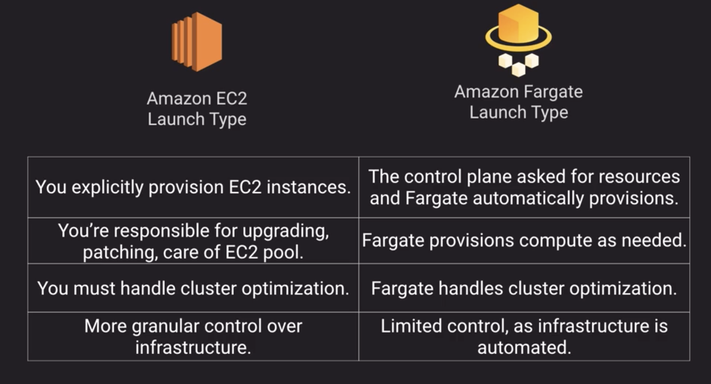
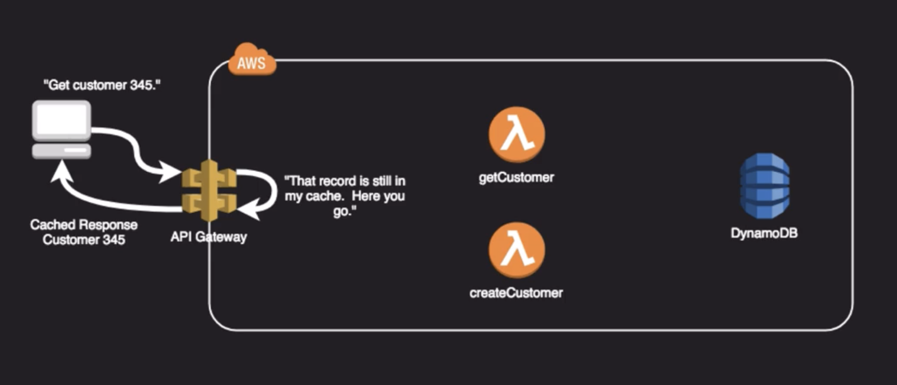
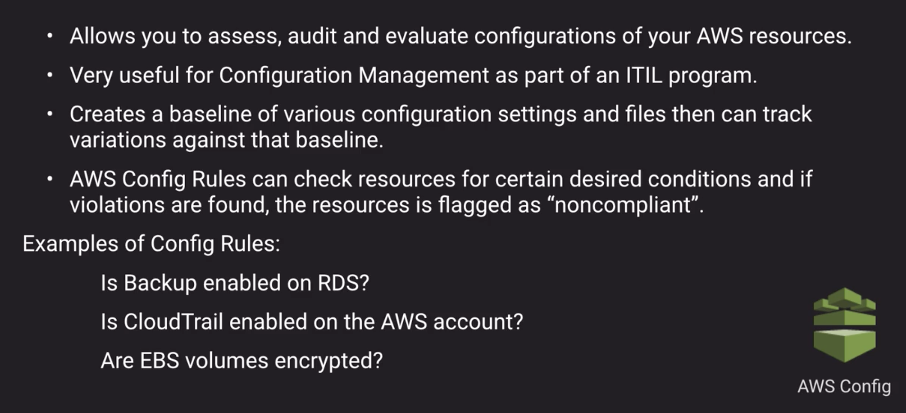
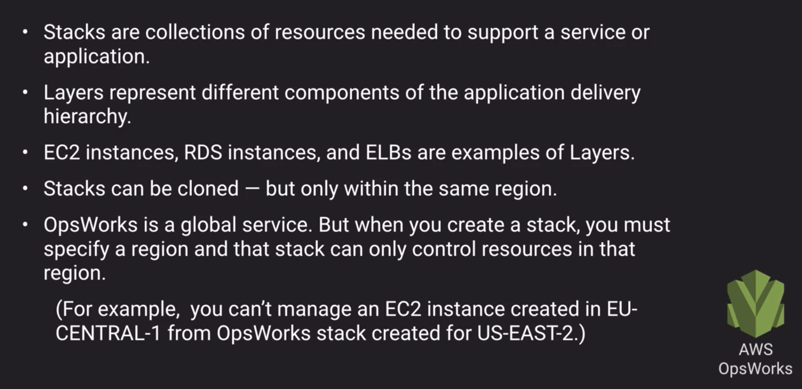

## Deployment and Operation Management

### Deployment Types

- Big Bang: everything goes live all at once
Takes least time but most risky
- Phased Rollout: Gradual Deployment
Takes moderate time and least risky
- Parallel Adoption: keep both old and new at the same time.
Takes most time but lowest risk

A/B testing

Canery

Blue/Green Deployment

Blue/Green Deployment methods

- Update DNS with Route53 to point to a new ELB or instance
- Swap ASG already primed with new version instances behind the ELB
- Change ASG launch config to use new AMI version and terminate old instances
- Swap env url of Elastic BeanStalk
- Clone stack in AWS OpsWorks and update DNS

Blue/Green Deployment unsuitable cases

- Data store schema is too tightly coupled to the code changes
- The upgrade requires special upgrade routines to be run during deployment
- Off-the-shelf products might not be blue-green friendly

---

### CI/CD considerations

- Objective is to create smaller, incremental compartmentalized improvements and features
- Lowers deployment risk and tries to limit negative impact
- Test Automation game must be STRONG
- Feature toggling patterns useful for dealing with in-progress features not ready for release (versus more traditional branching strategies)
- Microservices architectures lend themselves well to CI/CD practices

### Elastic BeanStalk

### CloudFormation

- AWS provides Py `helper scripts` which can help you install software and start services on your EC2
- Use CFN to make changes to your landscape rather than going directly into the resources
- Make use of Change Sets to identify potential trouble spots in your updates
- Use Stack Policies to explicitly protect sensitive portions of your stack
- Use a Version Control System such as CodeCommit or GitHub to track changes to templates

### ECS/EKS

### APIG

- Managed, HA service to front-end REST APIs
- Backed with custom code via Lambda, as a proxy for another AWS service or any other HTTP API on AWS or elsewhere.
- Regionally based, private or edge optimized (Deployed via CloudFront).
- Support API Keys and Usage Plans for user identification, throttling or quota management.
- Using CloudFront behind the scenes and custom domains and SNI are supported
- Can be published as products and monetized on AWS MarketPlace

### AWS Management Tools

AWS Config

AWS OpsWorks

### AWS System Manager