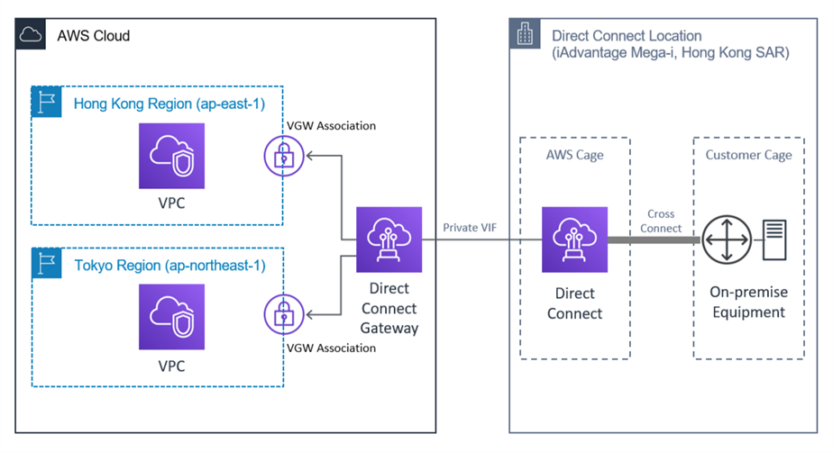

## Key points next q 133

### Autoscaling

- Redshift (data warehousing) cluster is **single AZ**
- Migrate the MySQL database server into a Multi-AZ Amazon RDS for MySQL.
- Enable API caching on API Gateway to reduce the number of Lambda function invocations.
- Use ElasticCache Redis when HA is a must, Memcached **DOES NOT** provide HA
- Use ElasticBeanstalk will give you least amount of efforts to enable autoscaling while keeping no service disruption
- Aurora volume will grow automatically up to **64 TB** by itself without the need from other auto-scaling driver i.e lambda.
- DynamoDB has no max data limit

### Business Continuity

- Spot instance can be interrupted. Reserved Instance provides massive discount and needs at least **1 year** rental term.
- Use DLQ (dead letter queue) for failed transactions reprocess.
- If `RPO` of 1 hour is required, it basically requires backup of data store to be hourly-based.
- CloudFront - Create two cache behaviors for static and dynamic content. Remove the **User-Agent** HTTP header from the whitelist headers section on both of the cache behaviors. Remove the **session cookie** from the whitelist cookies section and the **Authorization HTTP header** from the whitelist headers section for cache behavior configured for static content.
- **EBS is 10 times more expensive than s3**
- Workflow is best to be dealt with AWS SWF
- Month-end reporting -> Need read replica.
- Route53 Health Check needs the endpoint must return an HTTP `2xx` or `3xx` status code and must appear within first `5,120` bytes of the response.
- RDS cross-region snapshot copy could take hours to complete!!!
- There isn't `AWS-RunWindowsPatchBaseline` but is `AWS-RunPatchBaseline`.
-  CFN stackset lets you create stacks in AWS accounts across regions by using a single AWS CloudFormation template. 
- AWS WorkSpaces used for Windows RDP setup/access

### Cost Management

- Use lambda@edge when you can - it is a feature of Amazon CloudFront that lets you run code **closer to users of your application, which improves performance and reduces latency**. With Lambda@Edge, you don't have to provision or manage infrastructure in multiple locations around the world. You pay only for the compute time you consume - there is no charge when your code is not running.

With Lambda@Edge, you can enrich your web applications by making them globally distributed and improving their performance — all with zero server administration. Lambda@Edge runs your code in response to events generated by the Amazon CloudFront content delivery network (CDN).

- When s3 needs to be accessed by a group of orgs. S3 owner can impose a s3 policy to enable other orgs to have access to it subject to each of them having own aws account. Enable **Requester Pays on the bucket**. Have the orgs use their own aws credentials when accessing the bucket.
- EMR master node **CANNOT** be on a spot instance
- Amazon Athena is an interactive query service that makes it easy to analyze data in Amazon S3 using standard SQL. Athena is serverless, so there is no infrastructure to manage, and you pay only for the queries that you run. It's **CHEAP**. Can be integrated with AWS QuickSight for data visualization.
- Cost explorer, trust advisor, consolidated billing - 3 things to remember when considering cost-saving topics

### Migration

- Cert produced by AWS Cert Manager **CANNOT BE** cross-region
- Snowmobile is recommended for transferring data more than **10PB**
- AWS Application Discovery Service helps enterprise customers plan migration projects by gathering information about their on-premises data centers. It has 2 flavours - agent and agentless. When processes information is required, must use agent.
- AWS Database Migration Service does not work with ElasticCache
- Use AWS DMS - Database Migration Service to load and replicate the dataset between on-premise db and replication instance hosted on AWS

### Data Store

- Max EBS IOPS is **64000*.
- S3 IA is suitable for data that is accessed infrequently but still needs an **immediate access**.
- GP2 has **3 IOPS** per GB
- EFS has **higher latency** than EBS provisioned IOPS
- DynamoDB **DOES NOT** support CW events
- DynamoDB should be considered when a lot more reads than writes 
- cross-region replication has 2 copies and hence **double the cost**.
- ElasticCache requires implementation code in application
- S3 provides best durability

### Deployment and operation management

- API Gateway has a payload limit of 10Mb Size Limitation
- Use AWS SAM and built-in AWS **CodeDeploy** to deploy the new Lambda version, gradually shift traffic to the new version, and use pre-traffic and post-traffic test functions to verify code. Rollback if Amazon CloudWatch alarms are triggered.
- `--regions` is NOT a valid param in cfn cli.
- **`Aurora` cluster is multi-az by default**
- lambda can support up to 1000 concurrent calls per second. But limit can be increased.
- Service limit with cloudwatch requires users to be on **Business Plan**
- In dedicated host, `Host Affinity` is set to Host, an instance launched onto a specific host always restarts on the same host if stopped.

### Networking

- Site-to-Site VPN Conn **DOES NOT** provide high bandwidth. Each AWS Site-to-Site VPN connection has two tunnels and each tunnel supports a maximum throughput of up to **1.25 Gbp**.
- Software VPN with clustering has **ONLY** one conn and hence isn't HA
- Use **public virtual interface** on a Direct Connect to transfer huge amount of data over the weekend
- When being asked about data movement, choose `Public virtual interface` on a Direct Connect connection.
- Direct Connect taks **3** days to setup - Public Virtual Interface is time consuming as AWS will need to review client's request.
- max limit **125** peering conns per vpc
- VPN requires internet and does not unfold source ip
- VPC Peering does not block anything
- Public VIF - AWS Direct Connect public VIFs allow you to connect to the `AWS public endpoints with public IP addresses (such as Amazon S3 and Amazon DynamoDB) that are advertised to AWS` over Border Gateway Protocol (BGP).
- Private VIF - Connect you to a VPC via Direct Connect Gateway to any AWS region

- `Have 2 Direct Connect conn from 2 different network carriers` and attach them to the same Virtual Private Gateway will enable a reliable conn between AWS and on-prem
- IPv6 **NOT SUPPORTED** by NAT Gateway or NAT Instance

### Security

- Use **AWS Org** and add accounts from departments to an O(rg) (U)nit when seeing **autonomy/service isolations**. 
- **When choosing multi-account solution, OU is something you need to make sure is present!**
- Cloudtrail to SNS **DOES NOT** have filtering
- **Amazon S3 event notifications typically deliver events in seconds but can sometimes take a minute or longer. On very rare occasions, events might be lost**
- AWS Trusted adviser is NOT event driven, i.e., it must be scheduled. This means running it on some frequency, the quickest refresh is every 5 minutes. It helps with resources provisioning with best practices.
- Use AWS System Manager on all instances to manage patching
- S3 generated keys cannot be managed
- Use tag-based IAM policy to implement granular access control over certain resources. Read Tagging in [cost-management](./cost-management)
- AWS KMS CMK takes key control over from aws account owner
- Kinesis Firehose can encrypt s3 at rest
- **NOT POSSIBLE** to use `sourceip` on s3 bucket policy for VPC endpoint
- CloudFront and AWS Shield Advanced is good with DDos protection while WAF will support blocking IPs, SQL injection attacks and Bad Bots.
- SCPs (Service Control Policy) **alone are not sufficient to granting permissions to the accounts in your organization.** No permissions are granted by an SCP. An SCP defines a guardrail, or sets limits, on the actions that the account's administrator can delegate to the IAM users and roles in the affected accounts. 

---

### CloudFront

- 404 error when accessing objects on s3? **Add another origin and behaviour**.

### BealStalk

- `Swap Env URLs` option for Blue/Green deployment.

### Lambda

- CPU is allocated linearly in proportion to the amount of memory configured - You cannot control CPU allocation directly.