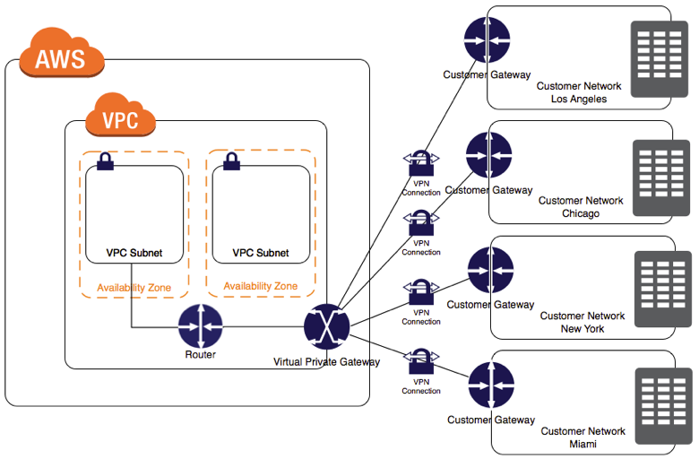
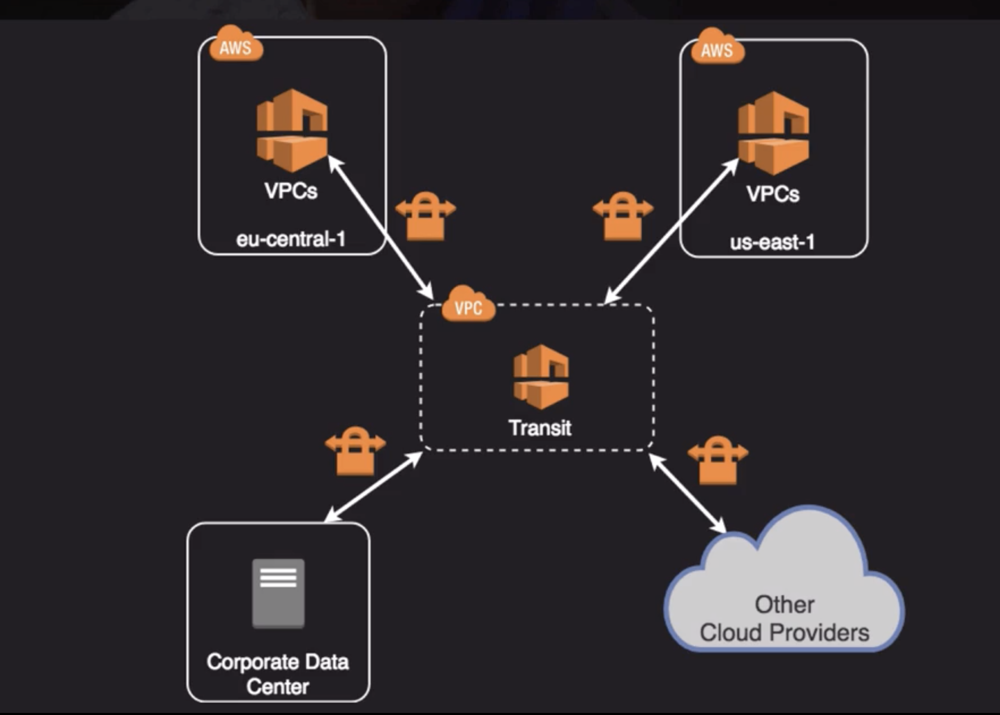
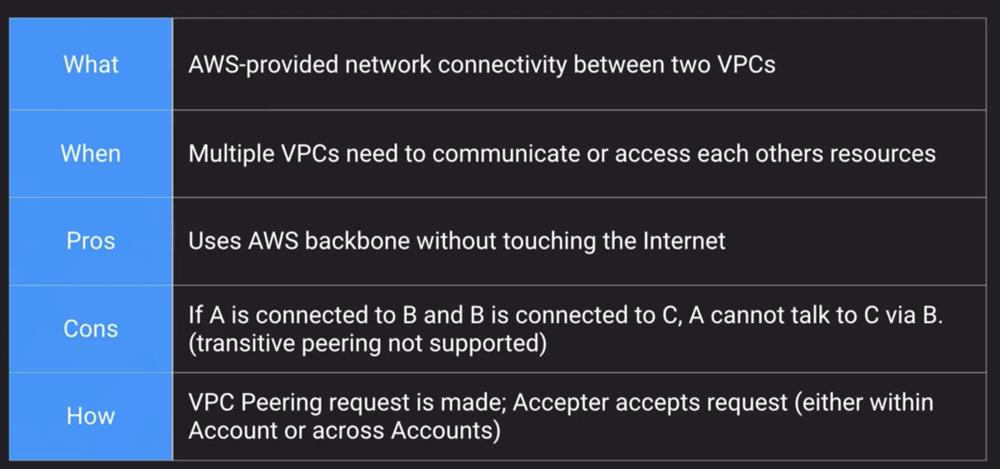
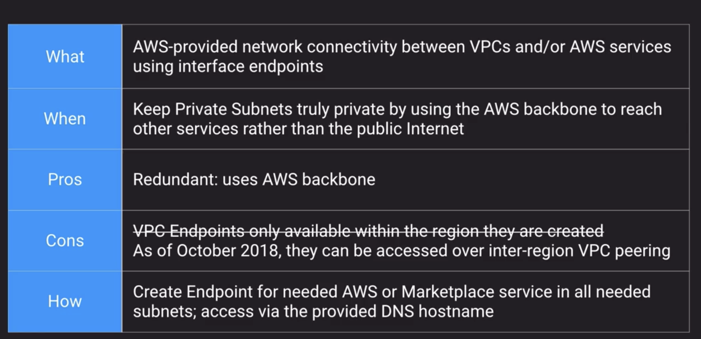
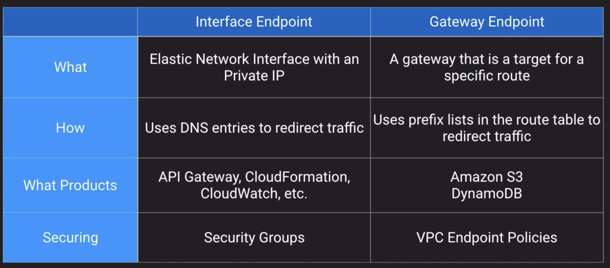
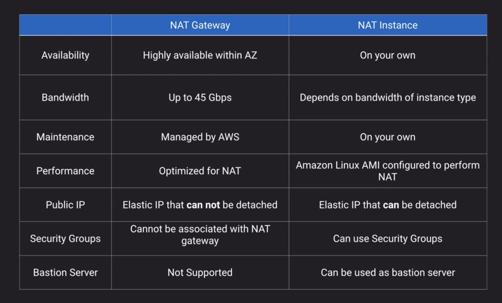
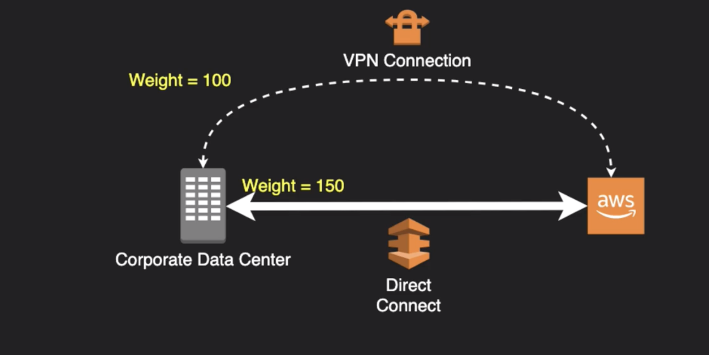
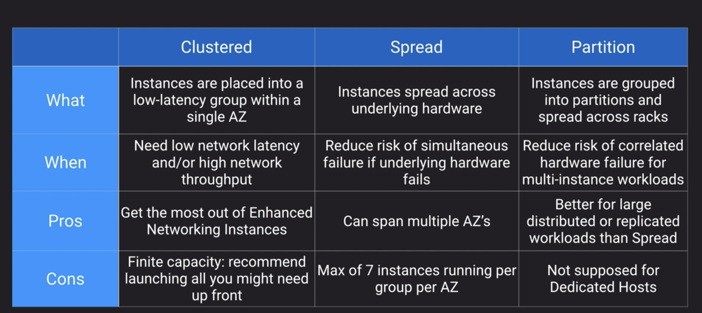
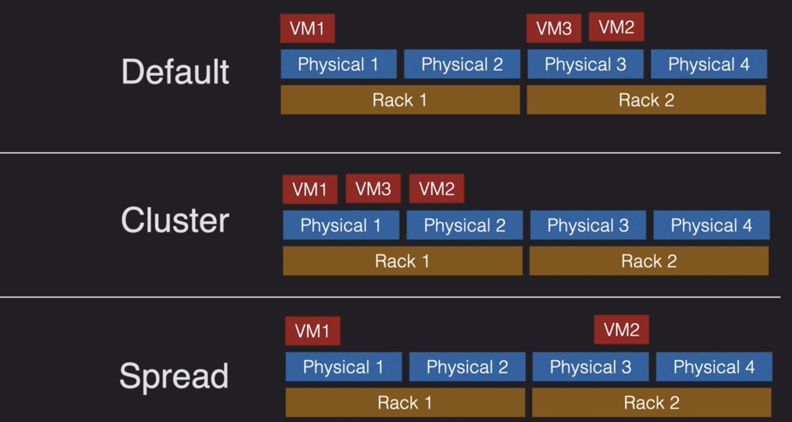
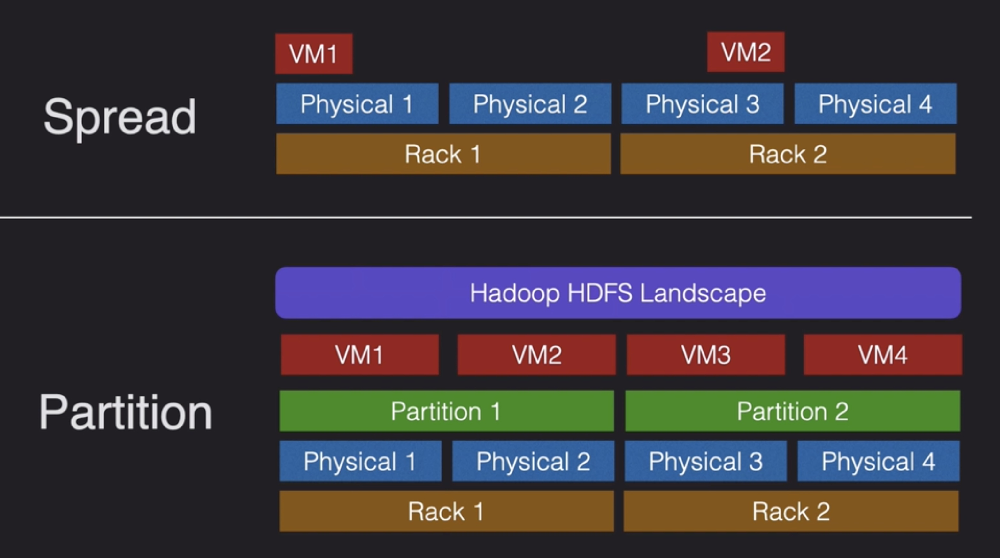

# Networking

## VPC

### NAT Instance/NAT Gateway

Each EC2 instance performs source/destination checks by default. This means that the instance must be the source or destination of any traffic it sends or receives. However, a NAT instance must be able to send and receive traffic when the source or destination is not itself. Therefore, you must **disable source/destination checks** on the NAT instance.

### OSI Model

TCP vs UDP vs ICMP

TCP

UDP

VPC Reserved IPs

### VPN

[on-premise conn to VPC options](https://docs.aws.amazon.com/whitepapers/latest/aws-vpc-connectivity-options/network-to-amazon-vpc-connectivity-options.html)

#### Multiple site-to-site VPN Conn

VPN Transit

### VPC to VPC

VPC Peering

VPC PrivateLink

VPC Endpoints

### IGW

- Horizontally scaled, redundant and highly available component
- No availability risk or bandwidth constraints
- Supports IPV4/6
- Perform NAT for instances wiht public ip
- Does not perform NAT for instances that only have private IP without public one

### Egress-Only IGW

- IPV6 addresses are globally unique and are therefore public by default
- Provides the capability of allowing IPv6 outbound traffic to internet

### NAT instance

- EC2 from a special aws-provided AMI
- Not supported for IPv6
- Private instances in private subnet must have route to the NAT instance, usually the default route destination of `0.0.0.0/0`

### NAT Gateway

- Fully-managed NAT service in place of NAT instance
- Must be created in a Public Subnet
- Created in specified AZ with redundancy in that zone
- For multi-AZ redundancy, create NAT Gateways in each AZ with routes for private subnets to use the local Gateway
- Up to 5Gbps bandwidth that can scale up to 45Gpbs
- Cannot use NAT Gateway to access VPC peering, VPN or Direct Connect, so be sure to include specific routes to those in your route table

### Routing 

Border Gateway Protocol Weighting in conn cutover. Higher weight wins

### Enhanced Networking

- Intel 82599 VF Interface 10Gpbs
- Elastic Network Adapter 25Gpbs

Placement groups

### Route53

### CloudFront

#### To use custom cert, you have 2 options:

- SNI - doesn't support old browsers
- Pay for each dedicated IP address for each edge location

### ELB

- consume IP addresses within a VPC subnet
- NLB doesn't do user authentication
- All load balancers support sticky session
- NLB excels in performance

#### Routing

- NLB routes traffic based on Port number
- ALB can route traffic based on 
    - Host-based routing
    - Path-based routing
    - HTTP header-based routing
    - HTTP method-based routing
    - Query String parameter-based routing
    - Source IP address CIDR-based routing
 ## Migration

 