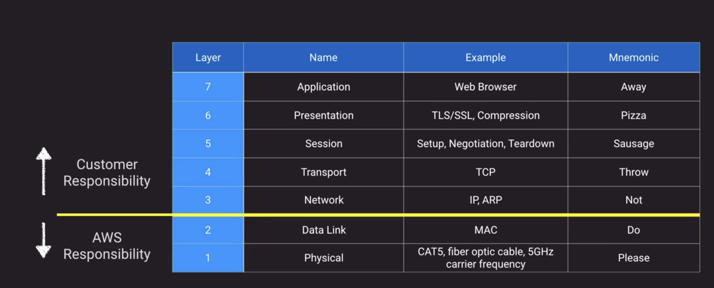
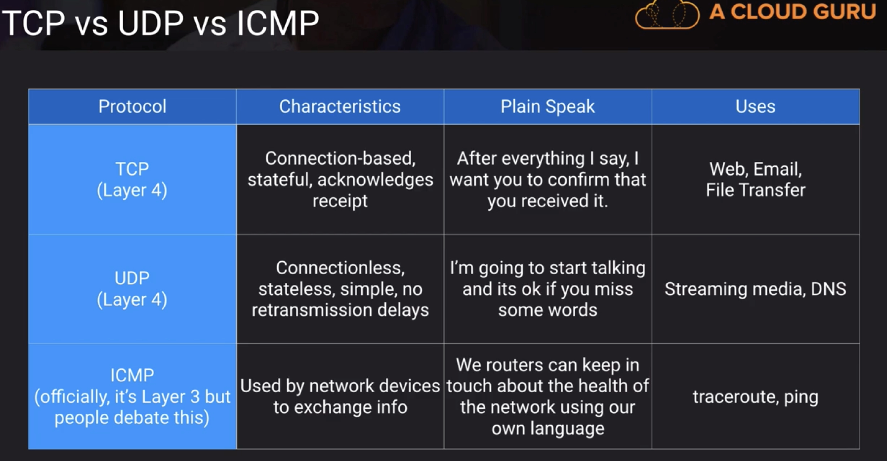
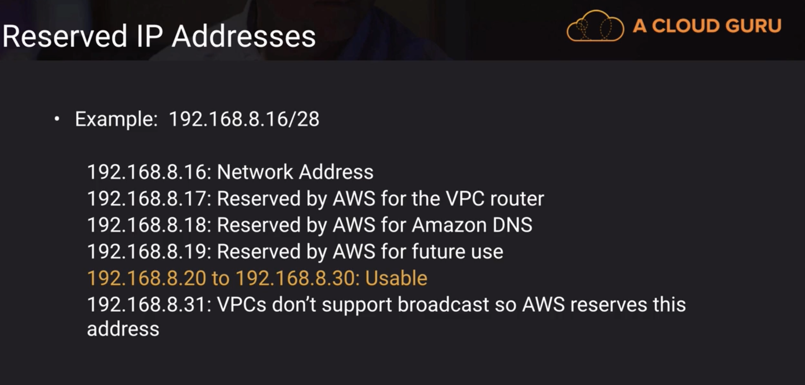

# Networking

## VPC

### NAT Instance/NAT Gateway

Each EC2 instance performs source/destination checks by default. This means that the instance must be the source or destination of any traffic it sends or receives. However, a NAT instance must be able to send and receive traffic when the source or destination is not itself. Therefore, you must **disable source/destination checks** on the NAT instance.

### OSI Model

TCP vs UDP vs ICMP

TCP

UDP

VPC Reserved IPs

