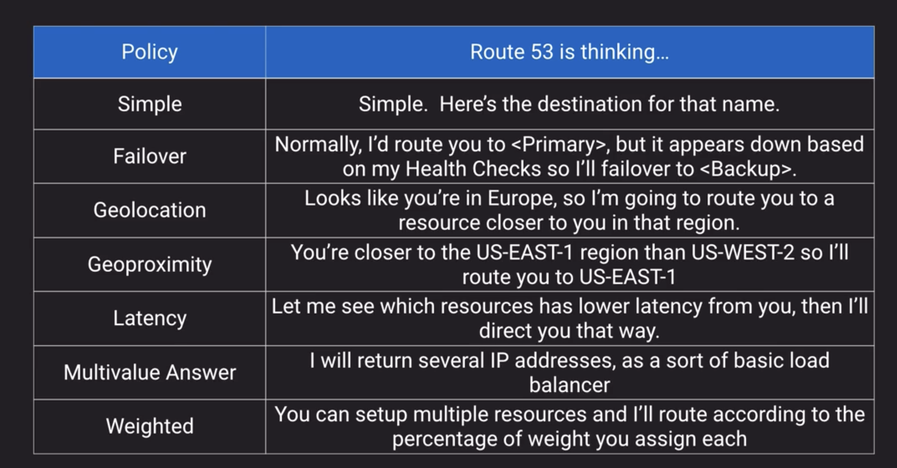

# Networking

## VPC

### NAT Instance/NAT Gateway

Each EC2 instance performs source/destination checks by default. This means that the instance must be the source or destination of any traffic it sends or receives. However, a NAT instance must be able to send and receive traffic when the source or destination is not itself. Therefore, you must **disable source/destination checks** on the NAT instance.

### OSI Model

TCP vs UDP vs ICMP

TCP

UDP

VPC Reserved IPs

### VPN

[on-premise conn to VPC options](https://docs.aws.amazon.com/whitepapers/latest/aws-vpc-connectivity-options/network-to-amazon-vpc-connectivity-options.html)

VPN Transit

### VPC to VPC

#### VPC Peering

- max limit 125 peering conns per vpc
- If you are using VPC peering, on-premises connectivity (VPN and/or Direct Connect) must be made to each VPC. Resources in a VPC cannot reach on-premises using the hybrid connectivity of a peered VPC. i.e VPC A cannot reach on-prem sitting behind customer gateway

- best used in inter-vpc communication between resources
- conn is less than 10
- lowest overall cost

#### Transit VPC

- hub and spoke design
- One central VPC (hub VPC) connects with every VPC (spoke VPC) via a VPN conn using [BGP](https://www.cloudflare.com/en-gb/learning/security/glossary/what-is-bgp/).
- Hub VPC contains EC2 instances running software appliances that route incoming traffic to their destinations using VPN overlay.
- Higher cost for running virtual appliances
- limited throughput per VPC (up to 1.25 Gbps per VPN tunnel)
- additional configuration and management overhead (customers have to manage the availability and redundancy of EC2 instances

#### Transit Gateway

- It's a regional service. You should restrict your architecture to just one Transit Gateway connecting all your VPCs in a given Region, and use Transit Gateway routing tables to isolate them wherever needed.
- Transit Gateway abstracts away the complexity of maintaining VPN connections with hundreds of VPCs.
- It removes the need to manage and scale EC2 based software appliances. AWS is responsible for managing all resources needed to route traffic.
- It removes the need to manage high availability by providing a highly available and redundant Multi-AZ infra.
- It improves bandwidth for inter-VPC comm to burst speeds of 50 Gbps per AZ.
- It streamlines user costs to a simple per hour per/GB transferred model.
- Decreases latency by removing EC2 proxies and the need for VPN encapsulation

#### VPC Peering outweigh Transit Gateway in the following areas

- Lower cost
- **No bandwidth limit** - 50 Gbps for Transit Gateway
- Smaller latency - Transit Gateway is an additional hop between VPCs.
- Security Groups compatibility

#### VPC PrivateLink

#### VPC Endpoints

#### AWS PrivateLink use case

Use AWS PrivateLink when you have a client/server set up where you want to allow one or more consumer VPCs unidirectional access to a specific service or set of instances in the service provider VPC. Only the clients in the consumer VPC can initiate a connection to the service in the service provider VPC. This is also a good option when client and servers in the two VPCs have overlapping IP addresses as AWS PrivateLink leverages ENIs within the client VPC such that there are no IP conflicts with the service provider. You can access AWS PrivateLink endpoints over VPC Peering, VPN, and AWS Direct Connect.

---

### IGW

- Horizontally scaled, redundant and highly available component
- No availability risk or bandwidth constraints
- Supports IPV4/6
- Perform NAT for instances wiht public ip
- Does not perform NAT for instances that only have private IP without public one

### Egress-Only IGW

- IPV6 addresses are globally unique and are therefore public by default
- Provides the capability of allowing IPv6 outbound traffic to internet

### NAT instance

- EC2 from a special aws-provided AMI
- Not supported for IPv6
- Private instances in private subnet must have route to the NAT instance, usually the default route destination of `0.0.0.0/0`

### NAT Gateway

- Fully-managed NAT service in place of NAT instance
- Must be created in a Public Subnet
- Created in specified AZ with redundancy in that zone
- For multi-AZ redundancy, create NAT Gateways in each AZ with routes for private subnets to use the local Gateway
- Up to 5Gbps bandwidth that can scale up to 45Gpbs
- Cannot use NAT Gateway to access VPC peering, VPN or Direct Connect, so be sure to include specific routes to those in your route table

### Routing 

Border Gateway Protocol Weighting in conn cutover. Higher weight wins

### Enhanced Networking

- Intel 82599 VF Interface 10Gpbs
- Elastic Network Adapter 25Gpbs

Placement groups

### Route53

### CloudFront

#### To use custom cert, you have 2 options:

- SNI - doesn't support old browsers
- Pay for each dedicated IP address for each edge location

### ELB

- consume IP addresses within a VPC subnet
- NLB doesn't do user authentication
- All load balancers support sticky session
- NLB excels in performance

#### Routing

- NLB routes traffic based on Port number
- ALB can route traffic based on 
    - Host-based routing
    - Path-based routing
    - HTTP header-based routing
    - HTTP method-based routing
    - Query String parameter-based routing
    - Source IP address CIDR-based routing
 ## Migration

 