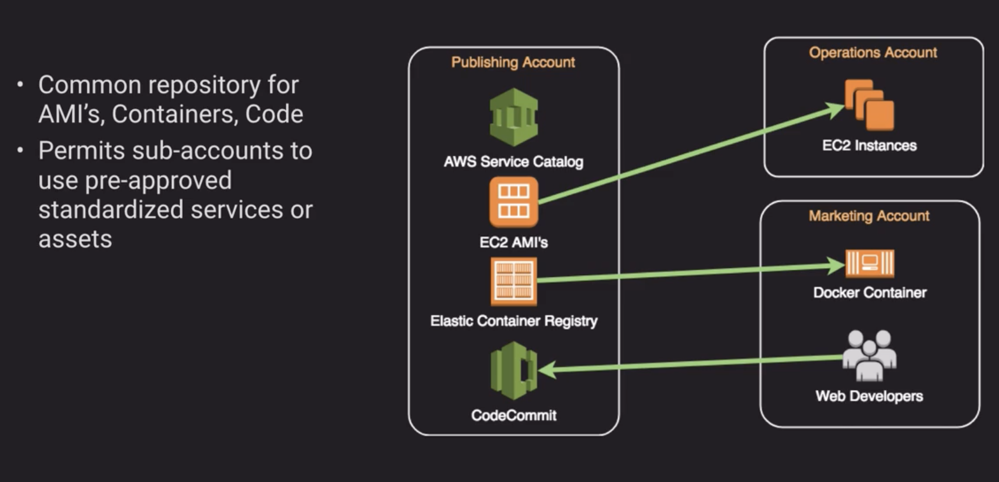

## Security

### Concepts

#### Auth workflow

#### SAML vs OAuth vs OpenID

### Multi-Account Management

#### Identity Account Structure

- Use cross-account roles. Create a role and make it use another aws account as trusted entity. i.e specify `development` account id to as trusted entity to use a role that's created under `production` account. That way `development` has the permissions that's granted to `production` account

#### Logging Account Structure

#### Publishing Account Structure

#### Credential and Access Management

### AWS Orgnization

#### Organizational Unit (OU)?

An organizational unit (OU) is a group of AWS accounts within an organization. An OU can also contain other OUs enabling you to create a hierarchy. For example, you can group all accounts that belong to the same department into a departmental OU. Similarly, you can group all accounts running production services into a production OU. OUs are useful when you need to apply the same controls to a subset of accounts in your organization. Nesting OUs enables smaller units of management. For example, in a departmental OU, you can group accounts that belong to individual teams in team-level OUs. These OUs inherit the policies from the parent OU in addition to any controls assigned directly to the team-level OU.
